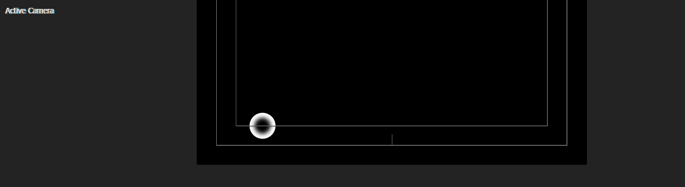
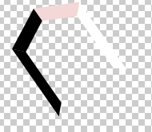
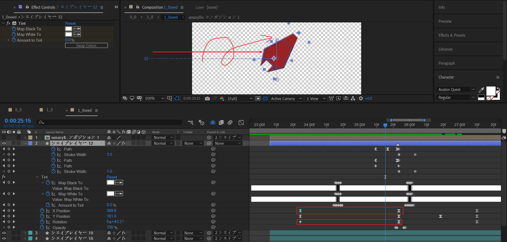

# 1_0

## 花散1

三个部分组成：

- 中心的白色填充圆环
- 外围的黑色描边圆圈（2个）
- 6个花瓣随机飞散。

### 外围：黑色描边圆圈扩散

思路是先制作一个圆圈，其余类似的圆圈通过副本复制和时间偏移来制作。

形状层绘制一个圆圈，黑色描边。

- 给size制作放大的关键帧，
- 在末尾处，给stroke width制作缩小到0的关键帧。

复制一层上面的圆圈图层，对这个副本图层往后偏移1帧。这样就能形成多个圆环扩散的效果。

### 中心：黑色填充圆环扩散

纯色层白色，添加mask 1绘制一个白色填充的小圆圈，不需要羽化。给这个mask 1添加expansion扩大的关键帧。

现在形成了白色圆圈放大的基本效果。

---

复制这个mask 1为mask 2。添加一定的羽化值，产生边缘模糊过渡。将继承的expansion关键帧时间往右偏移几帧。

然后将mask 2模式修改为相减。

稍微调整关键帧的开始值和结束值，使得符合扩散效果。

---

最后，添加Fill，将纯色层填充黑色。

### 6个花瓣随机飞散

取其中一片花瓣进行定性分析：

纯色层填充白色，绘制初始的花瓣mask形状

通过修改mask来制作关键帧，换言之，每一个关键帧，对应的是:

- 时间的右移
- 花瓣空间位置的变化。
- 花瓣形态的变化。这里本质是修改mask形状来伪造花瓣3D翻转。

这样，就形成了花瓣沿一定路径运动的效果。这就是飞散的雏形。

> TODO: 物理受力分析。X+方向一个初速度，Y-方向模拟风力，末尾处至少翻转一圈。

> TODO：探究mask path 关键帧速度曲线。

这样，一片花瓣的运动就基本完成。

---

多个花瓣运动的整体设计。

三个关键点：

- 黄色框区域：为花瓣运动的区域覆盖，集中于画布下半部分。
- 红色箭头：整体，从左下角到右上角移动。
- 蓝色曲线：表示花瓣之间必须在空间上有交错的运动重叠。

## 花散动画组1——3次花散

打开标尺，可以借助参考线大致确定花散1合成开始的中心点位置。对X 位置K帧实现缓慢右移。

---

对花散1合成在项目管理面板进行独立复制（Ctrl + D），形成花散2合成。

> 为什么要独立复制一份花散出来？
>
> 花散2合成和花散1的区别在于：花瓣mask关键帧的修改和调整。个人认为是为了给运动路径创造变化，避免跟之前完全一致。

将花散2合成延迟出现，出现的位置比之前的花散合成1稍微右偏移（参照画面标记2位置）。

---

利用花散组1副本，继续制作视觉空间上的右移出现。

总体而言，这是根据音乐开场时较为舒缓的节奏，制作了三个花散合成单元：分别是花散1，花散2，花散1。

## 花散动画组2——5次花散

有了上面的花散制作经验，下面的花散就比较容易制作了。需要注意的关键点是花散合成单元之间的时间间隔，必须呼应音乐节奏。

这里花散之间的时间间隔较短，对应比较急促的音乐节奏：一共5个点，因此使用了5个花散合成。分别是花散合成2,1,2,1,2。

预览窗口中序号1-5表示时间上的出现顺序。

## 花散动画组3——7次花散

这里重复了之前的制作原理，不再赘述。依旧需要注意花散合成出现时间点需要大致对应音乐节奏。

这里使用了7个花散合成。图中给出了原作出现位置的大致标注。从视觉残留上分析，所有位置出现点之间的连线形成了往返的曲线。

在这里，关键是位置的往返。

## 花散动画组4——5次花散

## 花散动画组5——2次花散

序号2的花散，这里不再需要X右移，而是位于画面中心进行飞散。

---

在上面描述的花散动画的同时，终于迎来了音乐节奏的改变。

## BOF 2010 入场

这个阶段是主题入场。一共分为四个动画部分：

- 结束画面椭圆形暗角效果
- 背景白色变深红
- 文字从模糊到清晰出现
- 一片彼岸花瓣飞入

### 取消暗角

椭圆形暗角之前使用的是【纯色层+椭圆mask+羽化】来实现，消失为opacity淡出。

### 背景变为深红

背景白色变深红，属于背景纯色层opacity淡入。

### 文字动画部分

这里文字有两个动画：

- 文字间隔从负值到一个合理的正值，表现为文字间隔扩大。
- blur值仅作用于X轴，文字从水平模糊到正常值。

此外，给中央文本制作一个鲜红的矩形背景。这里是使用矩形mask瞬间飞入，并Y轴扩展的形式来实现。

### 一片彼岸花瓣飞入

伴随文字主题的揭示，这里使用形状层单独制作一片彼岸花瓣，初始化颜色为深红填充。

按图中箭头方向，进行一个位置的移动，然后对XYZ轴旋转K帧，补充细节。这个阶段结束时，花瓣位于左上角位置。

---

接着，花瓣需要缓慢加速，最后高速飞回画面中央。依旧对XYZ旋转进行K帧，补充细节。留意此时花瓣颜色是白色。

### 背景改变+花瓣颜色改变

利用tint效果对花瓣进行着色K帧，实现白-红-灰-白-红的变化。

文本矩形背景也需要进行对应的改变，以匹配花瓣的颜色变化。因为变化过程比较复杂，这里列表说明。

|              | 1    | 2    | 3    | 4    | 5    |
| ------------ | ---- | ---- | ---- | ---- | ---- |
| 花瓣         | 白   | 红   | 灰   | 白   | 红   |
| 文本矩形背景 | 鲜红 | 鲜红 | 白 | 深红 | 鲜红 |
| 分析 | - | - | **对比** | **对比** | - |

## BOF 2010 出场

将画面元素分为几个部分：

- 文字模糊出场。

- 三个花朵出现。分别为左上（尺寸中），居中（尺寸大），右侧（尺寸小）。其中，居中的花朵有一片花瓣来自之前的那个飞入的花瓣。
- 居中的花朵外围有两个白色描边的圆圈扩散，圆圈的描边为：外圈描边大，内圈描边小。

- 背景两层粒子流。颜色分别为白色，红色。运动方向都是水平向右。

- 两个飘动的曲线。一个为白色填充宽度较粗，一个为多个细线组成，线条很细。运动方向都是水平向右擦除。

一旦动画拆解完成，下面就是独立分析其中的实现和细节了。

### 文字出场

BOF 2010文字的消失动画：字间距继续扩大，X轴模糊从0到合理正值，最后淡出。

### 三个花朵出现

我们先来关注居中的花朵的形成，然后再关心背后两个花朵的形成。

居中花朵。

一个花朵含有6片花瓣，之前已经有一片，还需要制作5片。

这个5片花瓣使用之前那片花瓣的图层副本来制作，不同的只是出现的时间点和图层生命长度裁剪，以及最为关键的颜色变化。

原作者给这6片花瓣都标记了序号，我们先来确认这点。

对于花瓣图层的TINT着色关键帧，稍微调整时间偏移（可以左移或者右移），从而制作花瓣之间杂乱的着色变化。

示意图：

这部分着色的K帧没有固定的规则，可以自由发挥。

---

下面我们来看下背后两个花朵的制作。

这两个花瓣都是缓慢加速右移，然后在末尾减速。同时，给rotate加上关键帧，顺时针缓慢加速旋转，旋转幅度并不大。

我们现在进入这些flower合成里面，看下里面的实现。

---

flower合成。

先创建这样的版面。将花朵中心与画面中心标准对齐。

接下来考虑动画的制作，这里是要制作花瓣汇聚到中心位置的动画，同时含有着色的变化。

---

取其中一片花瓣（序号12）进行关键帧分析：

可以看到，既有tint着色的变化。也有position和scale的变化。

- tint：灰-白-红-白-红
- position：右移
- scale：从一个较大的缩放比例变化到100%。
- Z rotation： 初始化一个合理的旋转角度。这里XYZ旋转并不需要动画。

---

现在来分析所有花瓣入场的先后顺序。

红色竖线为时间线，注意上面的标记【1】【3】【5】【6】。分别表示该时刻有多少片花瓣出现。

- 7和9入场保持一致，空间位置关于X轴对称。

- 11和10入场保持一致，空间位置关于X轴对称。
- 8最后入场。

---

最后来分析所有花瓣着色关键帧的变化。有6个花瓣图层，每个花瓣图层一共有6个TINT关键帧。

为了方便比较，列表分析。

| 花瓣序号 | 被剪断 | 标记[1] | 标记[3] | 标记[5] | 标记[6] | +1   | +2   | +3   | +4   | +5   | +6   | +7   |
| -------- | ------ | ------- | ------- | ------- | ------- | ---- | ---- | ---- | ---- | ---- | ---- | ---- |
| 12       | ~~红~~ | 灰      | 白      | 红      | 白      | 红   |      |      |      |      |      |      |
| 11       | -      |         |         |         | 红      | 灰   | 白   | 红   | 白   | 红   |      |      |
| 10       | -      |         |         |         | @11     | @11  | @11  | @11  | @11  | @11  |      |      |
| 9        | -      |         | 红      | 灰      | 白      | 红   | 白   | 红   |      |      |      |      |
| 8        | -      |         |         |         |         |      | 红   | 灰   | 白   | 红   | 白   | 红   |
| 7        | -      |         | @9      | @9      | @9      | @9   | @9   | @9   |      |      |      |      |

说明：

- 7和9的着色保持完全一致。
- 11和10着色保持完全一致。
- 表格header栏+1，+2，表示时间偏移：帧数+1，+2。

---

最顶层的空对象绑定，猜测为位置统一控制。

### 居中花朵外围的圆圈扩散

对形状层的size K帧增大，实现扩散效果。这部分比较简单，我们继续往下看。

### 背景粒子流

创建一个900x360的合成，在里面创建一个文本层，输入星号*，白色字体。

然后复制足够多的副本层，差异化空间XY位置。这里是2D平面，没有Z轴。位置随机化原作者是手动调整的，高效率的方式是使用AE表达式按一定规则初始化position属性的范围，然后再根据个人审美微调。

---

粒子流动画。

回到合成外，对粒子流合成添加motion tile和fast blur。

motion tile用于实现X轴位移。给拼贴中心赋值表达式：`[300+time*670,180]`。显然，这里只对X轴制作移动。300是X初始偏移，time*670为偏移速率。

fast blur用于伪造粒子运动模糊，这里只给了水平方向上的模糊。

另一个红色粒子流的制作只需要使用上面的合成副本。将粒子颜色改成红色即可。可以通过调节层整体Fill或者修改文本层字体颜色来实现。

最终效果。

### 两个飘动的曲线

---

先说明白色填充曲线的动画制作。新建一个900x360的合成。

使用形状层绘制一个类似彩带的曲线后，添加线性擦除。使用这个来制作入场揭示。

然后再次添加线性擦除，使用这个来制作出场擦除。

---

然后是含有白色细线的曲线的动画制作。同样地，创建一个独立的900x360的合成。

使用形状层绘制一条曲线。添加修建路径，通过对修建路径start和end属性添加关键帧，可以实现曲线从头部出现和从尾部消失。

---

然后添加中继器，创建多个曲线副本。这里是5个副本。

并对形状层position K帧。从一个正值到一个负值。调节标准为：使得图中箭头指示的重合点位于画面中心稍微右侧。

---

这时，曲线还是比较粗的。

复制一份上面的形状层。对副本层（index 2）使用alpha 遮罩，**并调整position的Y值**。以180为标准，稍微左右偏移，目标效果为：**直到曲线变细但是又不断开**。数值在这里没有很大的参考意义，但是请记住调节的目标。

## 花朵与曲线1

### 花朵绽放

使用重用了之前的flower合成。只需要注意出现顺序和scale差异。

动画关键帧还是保持缓慢加速右移，缓慢加速顺时针旋转。

### 曲线组

这里使用了之前的曲线合成，在时间上序列化，同时对每个曲线合成制作右移的关键帧。

- 中央3个花瓣依次出现，index 85-87
- 同时逐个出现3个曲线，index 82-84
- 左侧出现2个曲线开始出现，index78-79

在置顶图层中，添加3个图层。

文本动画为：字符间距加大，模糊到清晰入场，清晰到模糊出场。末尾opacity闪烁多次。

内圈：为一个细描边的黑色圆圈，size扩大制作扩散。

背景白色圆：调节层，利用mask扩展实现扩散，最后opacity淡出。

最后，将这3个图层的开始时间点对齐花朵绽放1。

## 重复！

这段时间内，使用花朵合成和曲线合成副本（可能需要创建变体的独立合成），创造大量的视觉重复。

推测可以自由发挥，尽量利用视觉残留原理，使得新元素不断出现在新的位置即可。也就是，不要扎堆出现于同一个区域。

直到时间点来到 20:14 。此时，需要一个彼岸花旋转的过场。

## 彼岸花旋转过场

### higanbana 合成（彼岸花）

这里需要创建新的彼岸花合成。700x700。

这里面有两个形状层，分别对应内外的花纹。同时对rotation和scale属性K帧，实现放大的同时，旋转成为一个满圆。

那么，现在问题可以归结到如何制作花纹了。

**内花纹**。

使用钢笔工具绘制一片花瓣，使用中继器添加40个副本，将中继的锚点定于花瓣的底部即可，它就是圆心。

---

**外花纹。**

类似的原理，中继单元不同，中继副本数不同而已。

### 彼岸花的别名秀

彼岸花有很多别名。这里使用了：

> 狐花，地狱花，死人花，曼珠沙华，幽灵花，舍子花。

现在来看动画的制作。

首先一个别名和一个彼岸花合成相对应，因此文本被父链接到对应的一个彼岸花合成。

每个文本层都添加了两层Glow发光。这个是常见的发光思路。下面说明常规多层发光需要注意的细节。

一般而言，使用glow制作多层发光，需要差异化发光半径和发光强度。

常见搭配为：小半径，高强度；中半径，中强度，大半径，弱强度。这个思路来自于光流的能量衰减。

> 扩展阅读：PBR渲染 https://en.wikipedia.org/wiki/Physically_based_rendering

当然，上面并没有严格按照这个思路，指的是光半径和光强度的对应衰减不符。

此外，需要留意Glow Dimensions这个属性，发光方向可以是水平、垂直、或者水平+垂直的。

---

我们取其中一个搭配单元来分析关键帧。

文本层为模糊到清晰的入场，利用文字动画器的blur属性。

对应的higanbana合成，依旧是采用缓慢右移，缓慢顺时针旋转。

其余的搭配单元，关键帧稍有调整，体现在速度曲线和运动持续时间长度有差异，整体差别不大。

---

画面细节：调色与模糊。

使用调节层，添加曲线，整体压暗画面，RGB独立控制线可以按需调整。

使用调节层，添加fast blur，合理设置模糊度。

## 花朵与曲线2

首先是这样的一个过场。两片花朵，一个细线曲线从中间扫过。

---

接着是这样的画面填充。

这里，动画的设计仅有一个原则。新元素依旧从画面稍微空的区域出现，对于花朵和曲线都是这样。

持续这个模式，直到时间点25:06

## seed合成的制作

seed，顾名思义，就是指彼岸花的种子。

### seed的制作

中心一个六边形，四周6个梯形，一共7个图层完成seed的制作。

下面来看下这些形状层的关键帧动画。首先分析出场顺序，先忽略颜色变化。

中心6边形开始出现，然后就马上闪烁消失，最后才恢复出现。

四周6个梯形按时间延迟1帧分别序列化。列表说明出场顺序：

| 1                                                            | 2                                                            | 3                                                            | 4                                                            | 5                                                            | 6                                                            | 7                                                            |
| ------------------------------------------------------------ | ------------------------------------------------------------ | ------------------------------------------------------------ | ------------------------------------------------------------ | ------------------------------------------------------------ | ------------------------------------------------------------ | ------------------------------------------------------------ |
|  |  |  |  |  |  |  |

现在，可以开始处理着色变化了。原理是添加TINT，然后仔细地K帧。这里就不赘述了。

### 花瓣变成seed

我们将时间轴回拨，思考花瓣如何变成seed。

示意图：

| stage 1                                                      | stage 2                                                      | stage 3                                                      |
| ------------------------------------------------------------ | ------------------------------------------------------------ | ------------------------------------------------------------ |
|  |  |  |

这里是通过对形状层的path进行K帧实现，没有黑魔法，暴力K帧就可以。

### 花瓣入场动画和出场动画

入场。

对X 右移，对rotation制作顺时针旋转，幅度参考1圈半。保证中间关键帧是大约在图中的位置和倾斜角度。

---

出场。

- Y轴：上移和下移，注意下移距离比上移距离大。
- rotation：顺时针2圈左右。

好了，还差文字部分。

### 文字部分

新建一个合成来处理。

矩形条，线性擦除2次，使用线性擦除实现。

接着，是文字和下划线出现。

文字从左侧开始逐个字符出现，这里同时添加了模糊和字符偏移的变化细节。

下划线从中央向两侧伸展出现。

好了。seed种子制作完成。

## 圆圈放大-缩小-放大

solo显示这两个图层。两层白色描边的圆圈。

- size: 放大，缩小，然后放大。
- 百叶窗：完成度初始化0，擦除到一定程度，然后恢复到0。
- position：稍微右移。注意这里速度曲线为先快后慢。

---

在上面最后动画阶段，也就是两层圆圈放大时，新建一个新的白色圆圈从外汇聚到画面内，然后消失。通过size k帧实现。

上面这些圆圈的动画，是为了揭示seed的出现。

## seed的出现

seed的出现，有两个关键点。

第一：种子边缘高亮。这个通过在上面叠一层合成副本（index 31），添加starglow效果，并使用Add来加亮。

第二：文字描述出场。下面来分析文字部分的关键帧。

- 文字从右侧到画面左侧，于是对position K帧实现左移。
- 文字入场时从模糊到清晰，字符间距从大到小。文字出场时从清晰到模糊，字符间距逐渐加大。
- 文字在末尾淡出。

## 背景斜线扫描

在种子下落过程，制作背景斜线扫描。

斜线都是通过形状层绘制。按时间一定延迟序列化。

同时，背景从淡红逐渐变白。

这个合成以种子下落到图中程度截止。

可以看到，下落过程中，seed越来越模糊。这是通过对主体seed合成添加fast blur K帧实现。

1_0合成到这里结束。

## 小结

- 这个合成主要目的是揭示彼岸花种子的出场和下落。
- 最初的开场，使用花散合成来制作花散效果。注意对准音乐节奏。
- BOF 2010的出场，通过一片花瓣汇聚到中央，形成完整的一个花朵来揭示。
- BOF 2010的出场，搭配背景粒子和流动曲线使得画面更加饱满。可以将背景粒子和曲线看成点缀元素。

- 中间过场使用花散和曲线不断出现和自然消失来不断填充时间。
- 一个花瓣形变为seed来揭示彼岸花种子的出场，伴随圆圈扩散和收缩动画。在种子下落的动画过场，添加背景扫描线来丰富画面。

