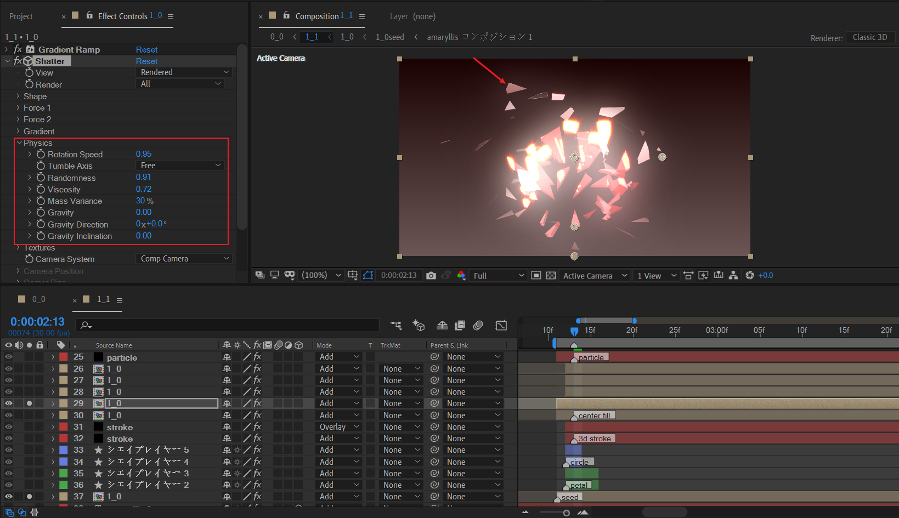
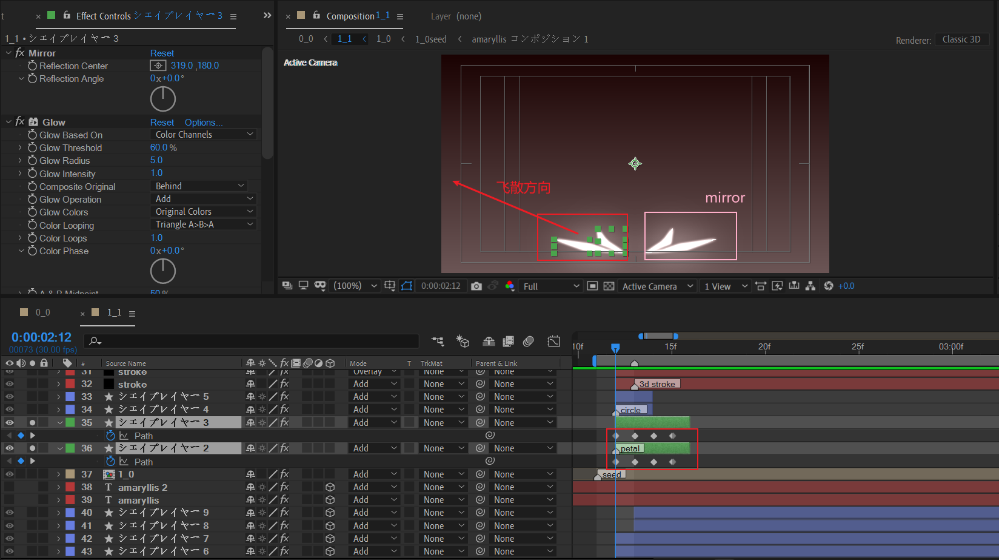
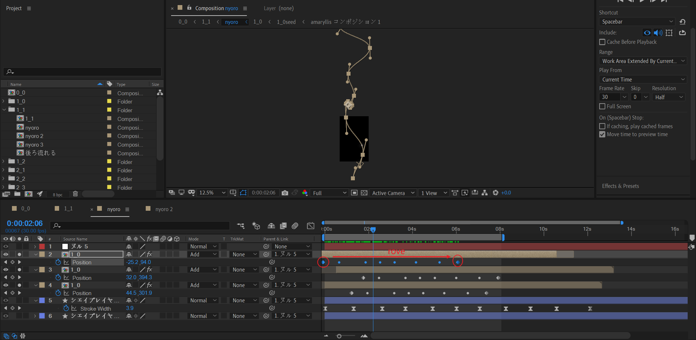

# 1_1

目标场景。

简洁而言，需要制作这样一个场景：一个种子掉落水面，瞬间破碎飞散，然后诞生很多往上生长的线条。

## 背景

初始化淡红色渐变背景。

## 种子破碎

复制之前的1_0合成，找到逻辑上的末尾帧，进行标记，并截断之前的时间长度。

这里，首先需要对种子进行加亮处理。然后制作种子碰撞到地面破碎，然后往反方向飞散的效果。

### 加亮处理

使用starglow和glow来实现。starglow重点是调整高光为白色，中间调为橙色，阴影为红色。

glow为整体白光发光，设置阈值为0，说明为无条件全部区域变亮。

### 碰撞破碎+反向飞散

破碎和飞散效果都是通过shatter效果来实现。

主要是设置radius和高光锐度来实现。注意关键帧持续1帧即可。后续会保持飞散动画。

原作者在合成的顶层位置，添加了两层调节层来处理画面调色。

使用fast blur模糊画面，使用curves从中间调位置稍微压暗画面。

## 加强种子破碎

### 主体大范围模糊强光

大范围模糊强光效果来自于图层副本与图层模式Add叠加。

### 更远距离的碎片

通过修改shatter效果物理属性来拉开碎片空间距离。

### 更小的碎片

### 更剧烈的垂直发光模糊

### 去掉发光后的碎片纹理

整体上叠加的效果预览截图。

## 底面波纹扩散

进行TOP视图查看。

四个圆圈。2个粗描边，一大一小。2个细描边，一大一小。

粗的2个圆圈先出现，然后细的2个圆圈出现。

## 花瓣飞散

绘制两个不同的花瓣，一大一小(图中红色线框)。对path进行K帧，往左上角飞出。

使用mirror效果进行镜像复制，以X=180为镜像轴。

下面是示意的飞散效果。

## 圆圈扩散

使用类似上面花瓣的制作方式，制作圆圈扩散。

## 细线条生长

这里需要制作一个线条往上生长的动画，使用3D stroke制作。

新建一个纯色层，绘制3个曲线路径mask。然后添加3d stroke。

这里说明3d stroke的关键参数。

- 将Taper 打开，这样绘制时开始笔刷较粗，尾端较细。
- 将repeater打开，instances设置多个，图中是3个实例。
- 最后，对End K帧从0到100。表示路径生长。

---

开始一段时间内，仅有一个stroke图层作用。

---

然后，底层stroke图层淡出，上层stroke图层淡入。此时线条变亮。

## 摄像机K帧

为了跟随线条的往上生长，新建摄像机并空对象绑定。从左视图观察，摄像机位置Y上移，目标点Y位置小幅度上移。

注意，这里摄像机位置位移距离和目标点位移距离不一致。

## 全局粒子

## 前面回顾

## 管道生长

### nyoro 合成以及变体

我们先来分析粗线条nyoro合成的内部制作。

两个关键点：

- 管道背景为白色曲线，保持不变；管道内管半径会周期性伸缩，一直保持循坏。
- 物体沿着道路曲线运动。有多个物体，先后经过。物体是指之前的1_0合成的seed。

---

管道的制作。

新建形状层，使用钢笔绘制曲线，Y空间跨度要很大，设置白色描边 10px。

原作中，这个合成为640x1002大小。可以据此估算这个管道的Y跨度，大约是合成的Y跨度的3倍。

复制一层管道，作为内管。内管半径伸缩对应着它描边大小的周期性变化。因此，也就是对描边宽度K帧。

红线框对应描边值的升降。速度曲线设置缓动即可。

---

1_0合成设置很小的scale值。运动路径必须和管道的路径一致,可以复制管道路径到合成的position.

然后再处理中间关键帧插值为rove类型（漂浮）。

> 参阅 [Create smooth motion with roving keyframes](https://helpx.adobe.com/after-effects/using/speed.html#:~:text=Create%20smooth%20motion%20with%20roving%20keyframes)

---

现在，根据修改管道路径的弯曲，以及调整运动物体1_0的个数，可以衍生不同的nyoro合成变体。

| nyoro                                                        | nyoro2                                                       | nyoro3                                                       |
| ------------------------------------------------------------ | ------------------------------------------------------------ | ------------------------------------------------------------ |
|  |  |  |

### 生长动画阶段1

分析关键帧。

这个阶段管道为亮红色。下面来看下关键帧动画。为了更容易分析，这里solo显示并分析其中一条管道。

- 首先将管道合成放于画面右侧不可见区域。
- 然后X左移，同时Y下移。
- 速度曲线注意：X轴位置移动为先快后慢。Y轴位置为缓慢加速，最后Y速度极高。

X轴位移方向控制从画面哪一侧进入，Y轴动画都是下移。因此，nyoro合成变体的X轴入场方向存在差异。

---

此外，注意到管道有大有小，这是通过复制副本，并修改X轴缩放来实现。

---

最后，理清入场方式，只有一组动画：右4，左2。

### 生长动画阶段2

第一组：2个从右侧进入，2个从左侧进入。

---

现在打开这4个图层的关键帧来分析。

注意到，在合成末尾时间范围，使用fast blur逐渐加大模糊度。

---

按照四个一组的模式。我们梅开二度。

第二组：依旧是2个从右侧进入，然后2个从左侧进入。

---

第三组：这里，跟之前入场方式有点差异。为右1，左1，右1，左1。非常对称的入场方式。

### 背景细节点缀：水平光束扫描

在上面的两个生长动画阶段之间，背景添加了一个水平光束扫描，作为点缀。

我们来看下关键帧。

- 使用motion tile来合适拼贴Y轴长度，因此对Tile Center的Y属性k帧，不断增加值。
- 使用fast blur在末尾时间逐渐加大模糊度。

## 该合成的结束画面

这个合成以画面逐渐白化到几乎过曝为结束点。逻辑上的结束时间点为40:11。

## 小结

- shatter制作破碎，3D stroke制作线条生长。
- 重复地利用合成副本，并编排左右的入场方式，可以节省工作量。同时利用了重复产生节奏感。

