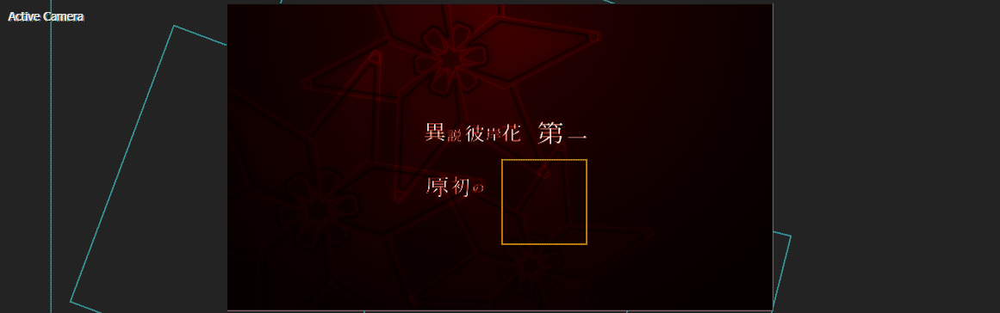
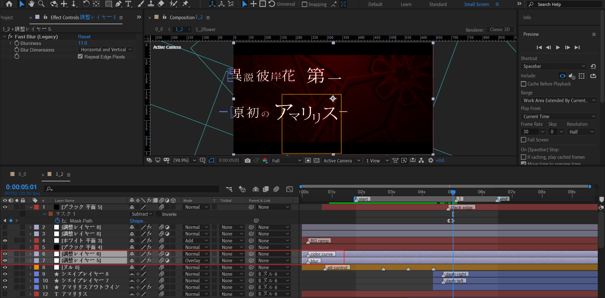

# 1_2

## 合成分析

这个合成中，我们需要制作这样的动画单元：

- 一朵花瞬闪入场，同时旋转，然后花发光逐渐消失，亮度恢复到正常状态。
- 花朵入场的同时，需要制作圆圈波纹扩散。

参考这个动画单元，需要制作一共4次这样的动画入场。每个动画入场，伴随一个不同的文本。

4个文本描述依次为：異説彼岸花、第一、原初の、アマリリス。

粗略分析完毕后，下面进入实现。

## 背景

纯色层+梯度渐变，使用径向渐变类型，上红下黑。

## 动画单元1：異説彼岸花

### 花朵的强光入场与恢复

首先使用前面制作过的花朵，创建一个flower合成。这个flower合成内部不需要任何动画关键帧。

然后复制一层，一层作为强光花朵图层（index 29），一层作为正常花朵图层（index 30）。强光花朵图层的强光通过starglow制作。

对上面两个花朵图层制作顺时针旋转，先快后慢，旋转幅度大约150度。

在合适的时间点，对强光花朵图层进行淡出，仅留下正常的花朵图层。

### 圆圈波纹扩散

制作早已熟练的圆圈波纹扩散，对齐强光花朵图层淡出的时间点。

### 文本部分

新建文本层，输入文本。选择该文本图层，鼠标右键：Create Shapes from Text。通过这种方式从文本层创建形状层（index 17）。

现在考虑文本的入场动画，截图分析。

经过仔细地分析，可以得知这5个字伸缩的方向和锚点都有所差异。更具体地，

- 异：以异字的右侧为锚点，从左侧方向一直拉伸到画面外。因此动画为从左侧拉伸逐渐变回正常。
- 说：偏旁“讠”的下面被垂直拉伸。因此动画为垂直拉伸的恢复。
- 彼：下面被垂直拉伸。因此动画为垂直拉伸的恢复。
- 岸：上面“山”字被垂直拉伸。因此动画为垂直拉伸的恢复。
- 花：以花字左侧为锚点，往右侧一直拉伸到画面外。因此动画为从右侧拉伸逐渐变回正常。

最后，文字汇聚到图中位置。

需要注意的是，这里对文本层添加了光学补偿效果，模拟鱼眼观察的效果。

### 整体控制

新建一个空对象，用于统一控制画面中的花朵，圆圈，和文本层。

这里对X、Y位置以及Scale都制作了关键帧。但最为明显的视觉感知是Y下移。X位置变化和scale的变化非常微弱。

---

另外说明，这里圆圈生命长度较短，扩散后就消失。

而flower合成生命长度很长，不会消失，在动画结束后会变得很弱，融入深红色的背景。

## 动画单元2

原理和动画单元1的制作基本一样。这里，只说明不一致的地方。

### 文字部分

将锚点定于自身大约居中位置。添加光学补偿后，可以得到类似光线放射的效果。

### 整体控制

这里关键帧都是极小的运动幅度，但是却不是静止不动。

---

动画结束后，得到下面截图。

## 动画单元3

### 文字部分

将锚点定于文字上方位置。

添加光学补偿后。

### 整体控制

这里关键帧依旧存在轻微运动，没有静止。

---

动画结束后截图。

## 动画单元4

### 文字部分

锚点居中。

光学补偿。

### 整体控制

## 整体出场

两个关键：Scale扩大，X左移。它们动画开始的时间点并不一致。

也就是，在放大的同时，画面全部前景元素往左出场，最后只留下深红色背景。

## 细节补充

### 画面调色

在顶层补充两个调节层，分别添加曲线和fast blur来调整画面。

### 压黑边

在画面元素出场的时间点，开始压黑边。

### 动画单元出场高亮

使用一个纯色层，添加上白下黑的渐变。模式设置Add。

然后对opacity K帧，图中值曲线四个下坡度分别对应动画单元1-4。

这样，花朵出场时高度过曝，非常亮眼。

## 小结

- 通过文本层创建形状层，然后对形状层的path来编排文字伸缩动画，借助光学补偿，可以得到非常炫酷的文字出场效果。

