# 2_1 彼岸花的花语

## 合成分析

### 序号01-03

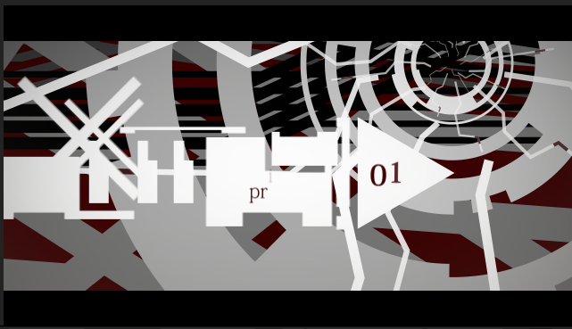

这个类型的场景，覆盖01-03标号。

### 中间过渡场景1

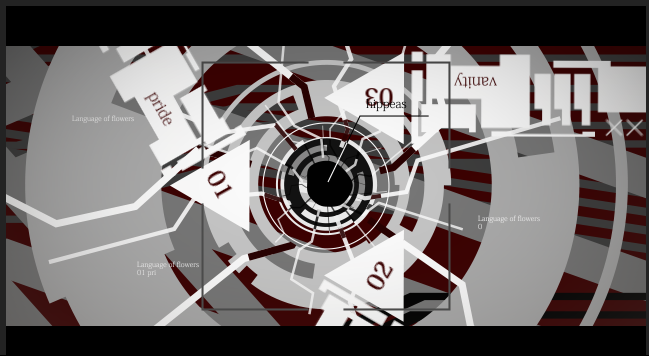

圆圈四周此时吸收01-03。

### 序号04-06

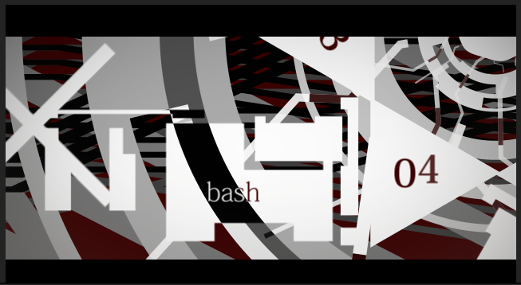

覆盖序号04-06。

### 中间过渡场景2

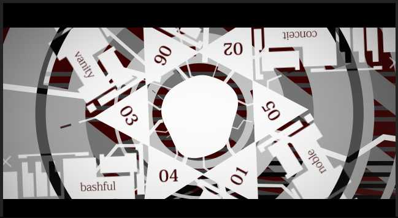

圆圈四周此时吸收01-06。

### 化学方程式

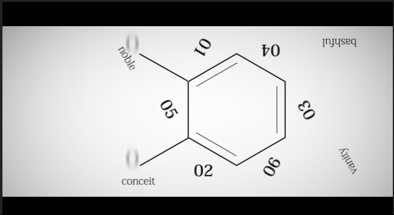

后续都是化学方程式，衍生了多次副本。

## 背景图层

### 纯色背景

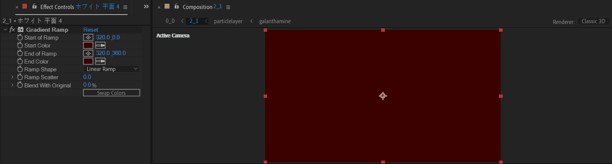

### 组件2合成

这是由多个线条的形状层组成的背景。下面说明实现方式。

使用形状层绘制一条折线。

然后使用中继器进行副本迭代。

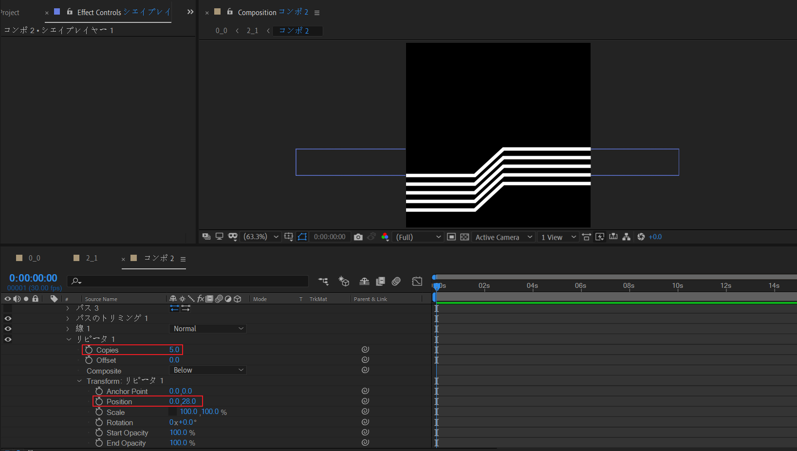

---

根据这种方式，制作其他两个折线组。合计3个折线组，15条折线。

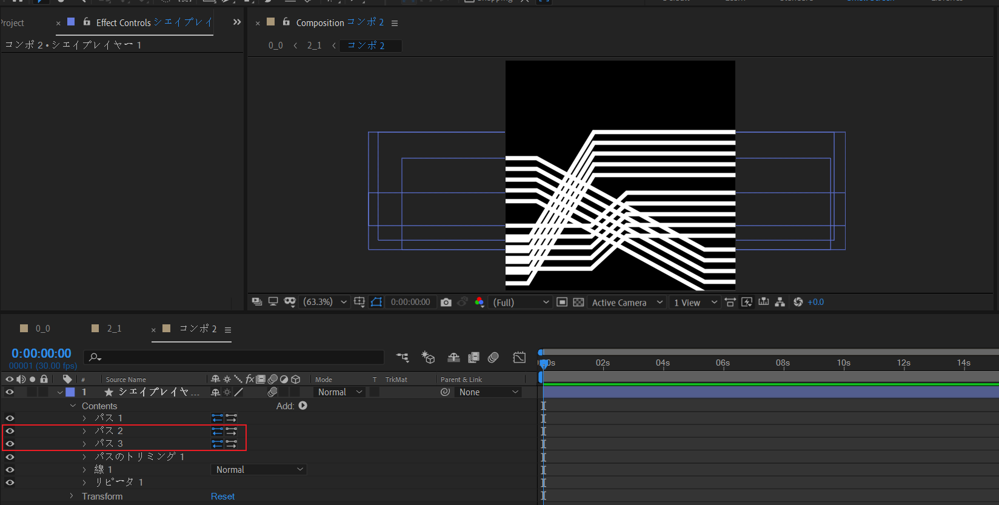

### 组件2背景

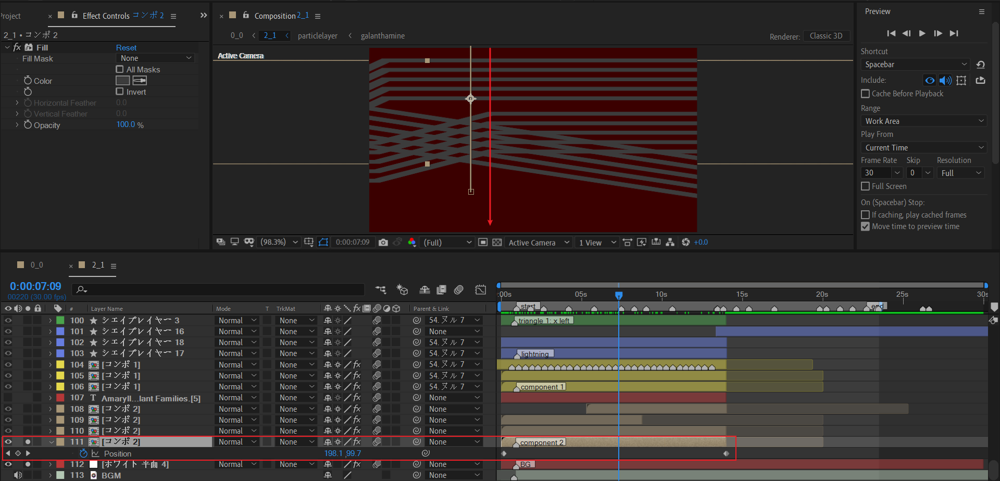

index 111图层运动方式为Y轴位置下移。

---

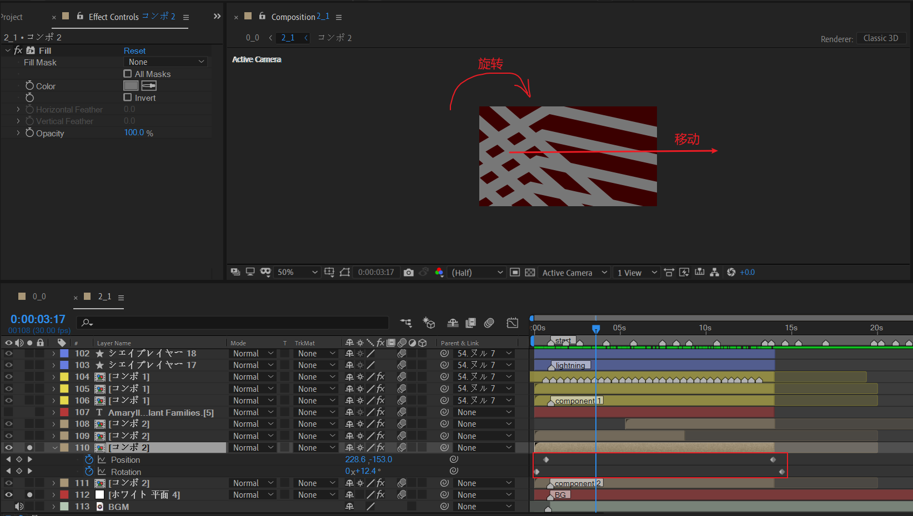

index 110图层为合成副本，增大了缩放值，合成position左移（视图右移），同时顺时针旋转。

---

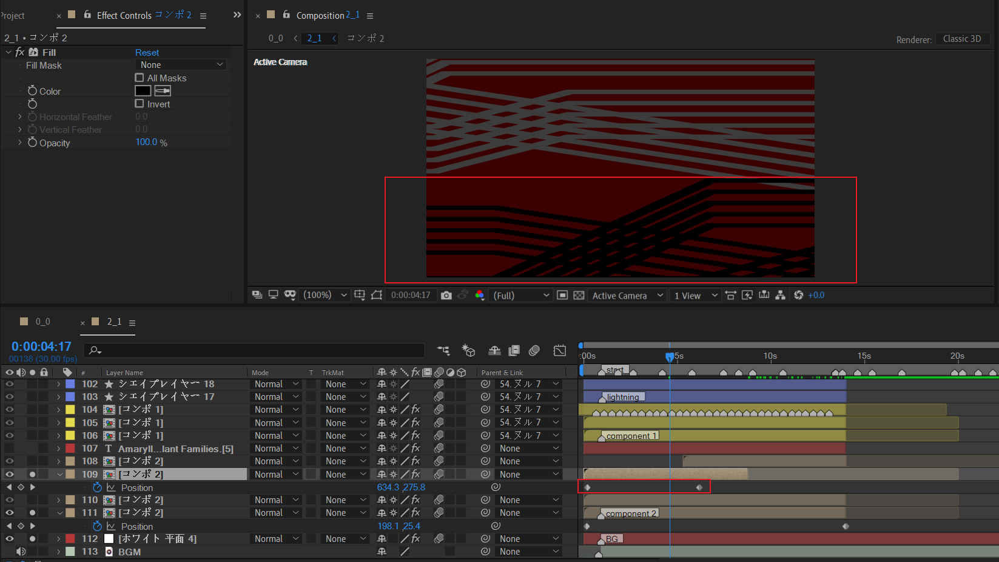

index 109图层和之前的index 111图层很类似，修改了颜色，并缩短了运动的持续时间，因此运动速度较快。

---

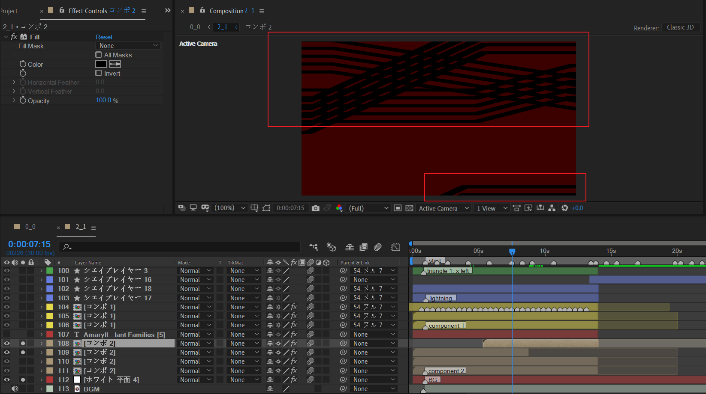

index 108图层为index 109图层即将运动出画面时，从画面上方进入，补充画面重量。

---

组件背景整体截图。

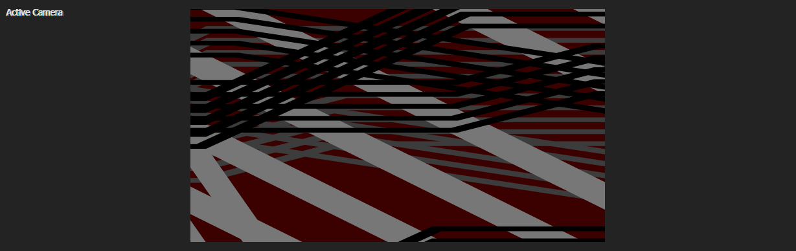

没有什么特别的地方，利用重复和变体使得背景显得内容丰富。

### 组件1合成

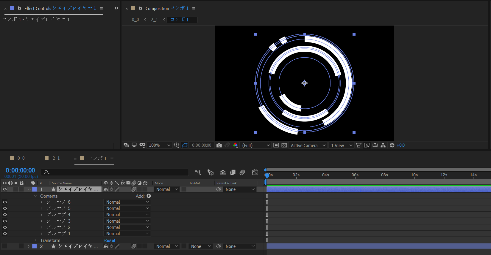

使用形状层绘制这样的同心圆弧。通过修建路径的End百分比来控制圆弧占比，通过offset的角度来控制旋转角度。

现在，这些圆弧都被填充为白色。

然后再下层新建一个形状层，绘制黑色描边的同心圆圈。

然后，对这个黑色圆圈应用alpha 反转遮罩。因此图中黑色区域可以保留，白色区域被删除。

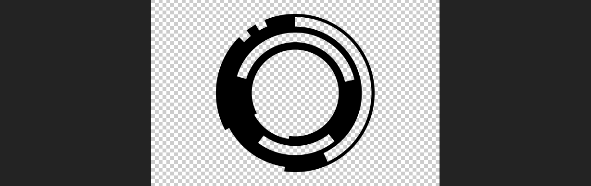

### 组件1背景

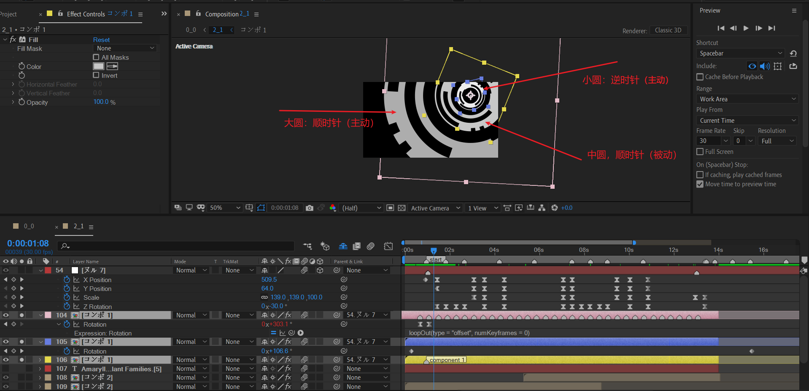

使用组件1合成制作三个同心圆，圆心初始为画面右上角区域。

- 小圆逆时针旋转，标注主动，因为它本身具有旋转关键帧。

- 中圆顺时针旋转，标注被动，因为它本身没有旋转关键帧。旋转是靠父级空对象控制的。

- 大圆顺时针旋转，标注主动，因为它本身具有旋转关键帧。

  这里需要注意大圆的旋转速度曲线。

  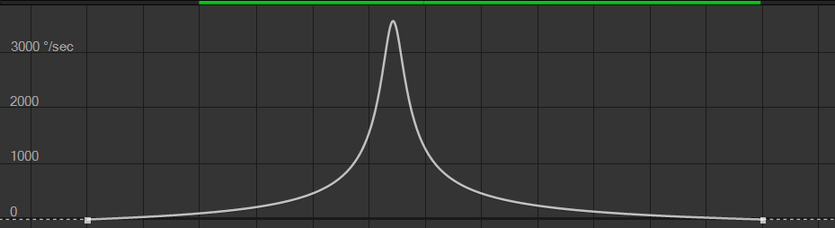

​        这种速度曲线的特点为中间极快，两边很慢。动画表现为有瞬间的急促感。

上面的截图中，你可以注意到index 54这个父级空对象，具有非常多的关键帧。这里先不急着阅读，后面会统一详细说明。

### 闪电单元

先来看下如何通过形状层制作闪电图案。

创建形状层，使用钢笔工具绘制这样曲折的线段连接。

然后使用修建路径，裁剪总体路径的百分比。整体旋转角度可以通过形状层的rotation控制。

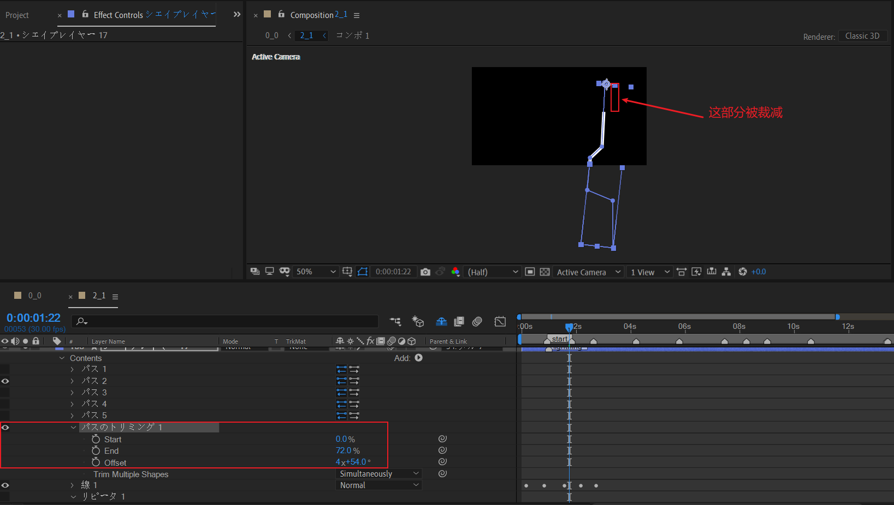

接着，使用中继器迭代副本。

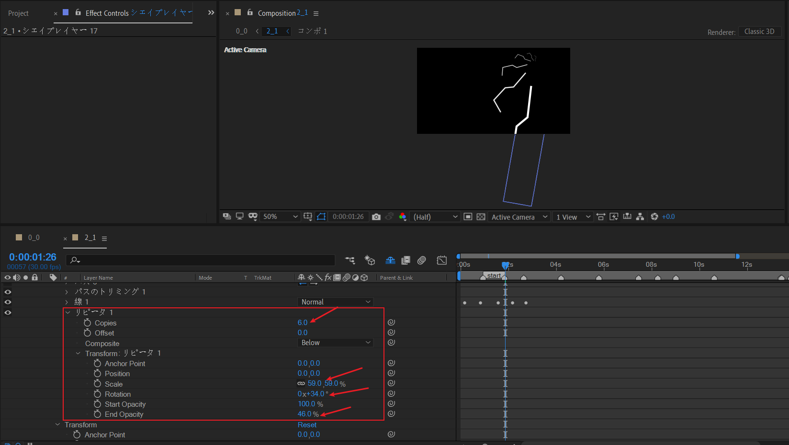

迭代6个副本，这里设置了scale的逐级缩小，rotation的逐级增加，以及末尾opacity的数值。

通过这种方式，一共绘制5个闪电基础单元，最终迭代的效果如下。

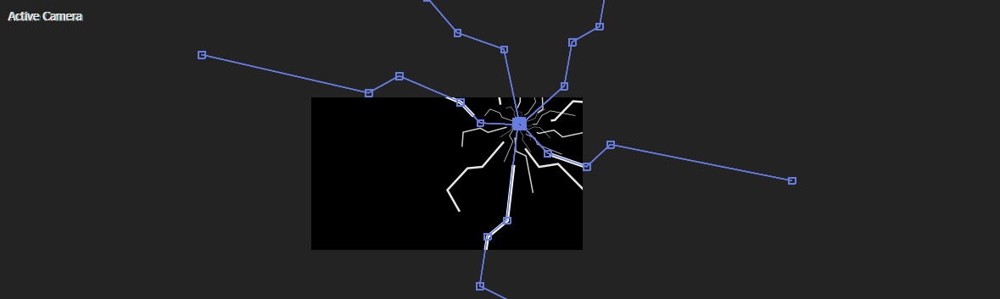

### 闪电背景

上面已经制作了一个白色的闪电。复制一层。

## 箭头运动

