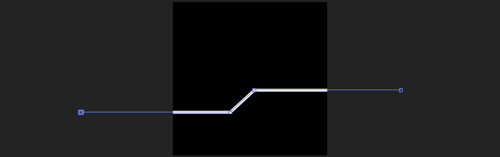
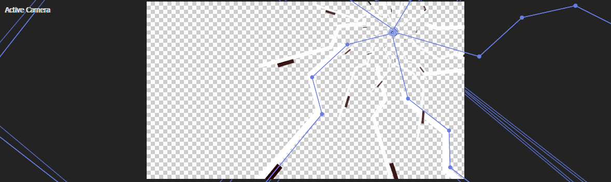
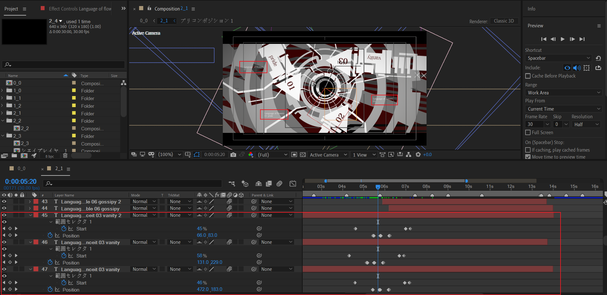
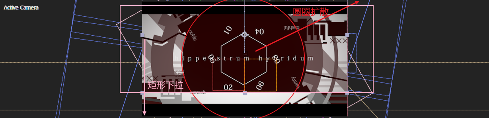
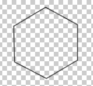
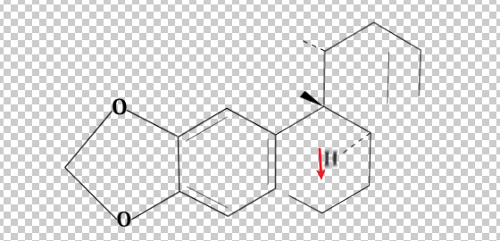
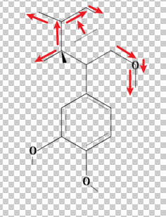
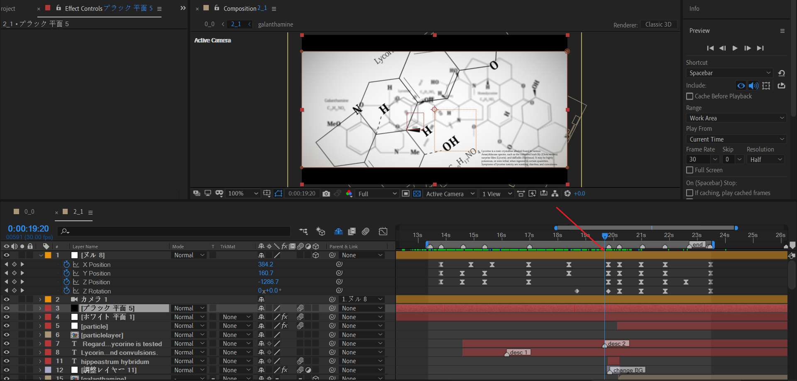
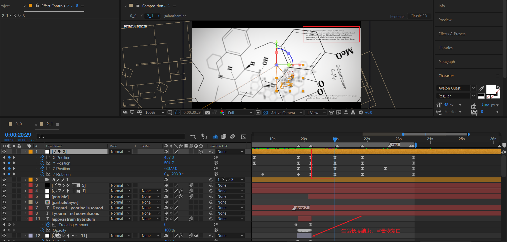
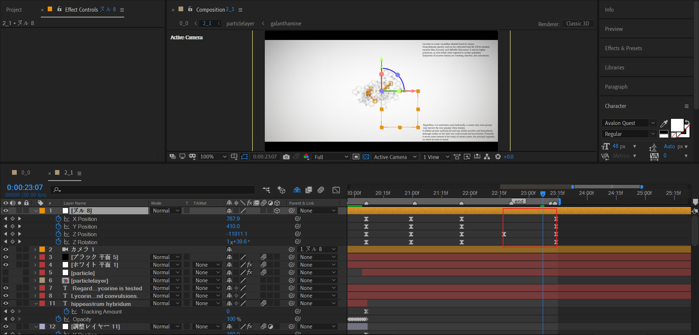

# 2_1 彼岸花的花语

## 合成分析

### 序号01-03

这个类型的场景，覆盖01-03标号。

### 中间过渡场景1

圆圈四周此时吸收01-03。

### 序号04-06

覆盖序号04-06。

### 中间过渡场景2

圆圈四周此时吸收01-06。

### 化学式

后续都是化学式，衍生了多次副本。

## 背景图层

### 纯色背景

### 组件2合成：折线组

这是由多个线条的形状层组成的背景。下面说明实现方式。

使用形状层绘制一条折线。

然后使用中继器进行副本迭代。

---

根据这种方式，制作其他两个折线组。合计3个折线组，15条折线。

### 组件2背景

index 111图层运动方式为Y轴位置下移。

---

index 110图层为合成副本，增大了缩放值，合成position左移（视图右移），同时顺时针旋转。

---

index 109图层和之前的index 111图层很类似，修改了颜色，并缩短了运动的持续时间，因此运动速度较快。

---

index 108图层为index 109图层即将运动出画面时，从画面上方进入，补充画面重量。

---

组件背景整体截图。

没有什么特别的地方，利用重复和变体使得背景显得内容丰富。

### 组件1合成：圆环组

使用形状层绘制这样的同心圆弧。通过修建路径的End百分比来控制圆弧占比，通过offset的角度来控制旋转角度。

现在，这些圆弧都被填充为白色。

然后再下层新建一个形状层，绘制黑色描边的同心圆圈。

然后，对这个黑色圆圈应用alpha 反转遮罩。因此图中黑色区域可以保留，白色区域被删除。

### 组件1背景

使用组件1合成制作三个同心圆，圆心初始为画面右上角区域。

- 小圆逆时针旋转，标注主动，因为它本身具有旋转关键帧。

- 中圆顺时针旋转，标注被动，因为它本身没有旋转关键帧。旋转是靠父级空对象控制的。

- 大圆顺时针旋转，标注主动，因为它本身具有旋转关键帧。

  这里需要注意大圆的旋转速度曲线。

  

​        这种速度曲线的特点为中间极快，两边很慢。动画表现为有瞬间的急促感。

上面的截图中，你可以注意到index 54这个父级空对象，具有非常多的关键帧。这里先不急着阅读，后面会统一详细说明。

### 闪电单元

先来看下如何通过形状层制作闪电图案。

创建形状层，使用钢笔工具绘制这样曲折的线段连接。

然后使用修建路径，裁剪总体路径的百分比。整体旋转角度可以通过形状层的rotation控制。

接着，使用中继器迭代副本。

迭代6个副本，这里设置了scale的逐级缩小，rotation的逐级增加，以及末尾opacity的数值。

通过这种方式，一共绘制5个闪电基础单元，最终迭代的效果如下。

### 闪电背景

上面已经制作了一个白色的闪电。复制一层闪电图层，修改填充颜色。

对于修建路径，修改End为更小的百分比。对offset设置时间迭代，制作闪电线段流动的动画。

---

截图预览。

## 箭头01运动：pride

> pride
>
> n. 骄傲；自豪；自尊心

### 出场

箭头从画面右侧，左移入场。

三角形内需要制作一个文本01，表示序号01。并绑定文本层到三角形。

文本层制作一个逐字下落的淡入动画。下面给出参数说明。

设置position的Y为负值，初始化字符位于正常位置偏上；设置opacity为0。

对start K帧0到100%即可。

---

### 顺时针旋转往上

这部分由index 54空对象控制，对Z rotation K帧。

## 组件装配合成

### 静态制作

我们首先需要制作这样一个表示形状层拼接的合成。

---

使用形状层绘制以下图案。

每一个形状层都是这个图案的一部分。绘制思路基本为基本图形+合并路径。这里限于教程篇幅，就不一一讲解了。

上面是图案的静态制作，下面讲解图案拼接的动画编排，也就是动的部分。

### 内部拼接动画

---

标注为5的运动步伐一致，标注为7的运动步伐一致。

---

---

动画结束截图。

### 外部绑定

在外部合成2_1中，将其绑定到对应序号的箭头形状层图层（index 100）。

---

添加文本层，输入文本pride。同样将其绑定到对应序号的箭头形状层图层（index 100）。

对文本层制作跟之前类似的字符下降的淡入动画。

## 箭头02运动：conceit

> conceit 
>
> n. 自负；狂妄；幻想

有了前面制作01箭头的经验，这个02就是如法炮制了。

## 箭头03运动：vanity

> vanity
>
> n. 虚荣心；浮华；空虚；无价值的东西

一样原理，不赘述。

## 中间过渡场景1

先来实现动画分解后的三个独立元素。

### 三球汇聚

使用中继器创建3个小球，间隔角度为120度。

向中心汇聚的自身动画，通过图案的position K帧来实现。整体的位置位移动画，通过index 54空对象控制。

### 融球

使用形状层绘制一个标准圆，然后添加wiggle paths。这就是融球效果的关键。

- 圆形路径的size控制球大小。
- 摆动路径的size控制摆动变化的幅度大小，值越大，变形幅度越大。
- 摆动路径的wiggles/second 控制曲线边缘的变化速度。

### 正方形百叶窗

首先来看基础正方形的动画。

首先，绘制一个正方形，对size制作放大的关键帧。

---

然后，添加两个矩形窄条。添加修建路径，模式设置为减去。

这样，当窄条扩大时，就形成了切分为四个小正方形的效果。窄条越大，四个小正方形面积就越小。

---

再次添加一个正方形图案，当这个正方形扩大时，整体图案的面积就会被逐渐减去，直到完全消失。

---

最后，添加百叶窗擦除，丰富细节。

这个阶段结束时，正方形变化为四个边角框。

### 位移到居中

按照红色箭头的方向，将03移到画面边缘，使得之前右侧的背景圆环的圆心来到画面完美居中。如下图所示。

### 圆圈扩散与汇聚

图中有四个元素，分别是大圆，小圆，引导线和文本。

下面讲述4个红色矩形框的关键帧作用。

- 小圆动画：先从0放大，位移一段时间，然后缩小。使用形状层实现。
- 大圆动画：从画面外汇聚到画面中心，缩小到0，然后又扩大到画面外。使用形状层+纯色层+轨道遮罩实现。
- 引导线：从0擦除到100%，然后从100%擦除到0。使用形状层实现。
- 文本层：逐个字符擦除，跟随引导线，但是动画节奏比引导线慢几帧。也就是引导线先出现，文本后出现。引导线先消失，文本后消失。

---

理解了红色矩形框的动画关键帧，粉色矩形框的关键帧理解起来就非常简单了。复制红色矩形框，按需调整即可。

注意，这里粉红色关键帧对应后面的过渡场景2，可以在后面制作时返回参考。

### 长文本描述

三个不太起眼的文本描述。单独显示这些文本层，并选择一个文本层进行动画分析：

添加动画范围器进行逐个字符的淡入。同时对整体文本层进行position的K帧，这里是每显示一行文本，就整体上移一格单位。

### 过渡1的出场

这里依旧不仔细讲解index 54空对象的控制。只需要理解是使用空对象，将之前居中的圆环恢复回右上角即可。

接下来，就是04-06序号对应箭头的运动了。

## 箭头04-06运动

### 箭头04运动：bashful

> bashful
>
> adj. 害羞的，腼腆的

### 箭头05运动：noble

> noble
>
> adj. 贵族的；高尚的；宏伟的；惰性的

### 箭头运动06：gossipy

> gossipy
>
> adj. 漫谈式的；喜饶舌的

### 小结

前面，分别将04-06插入到之前圆环剩下的空位中。下面是最终位置示意图。

## 中间过渡场景2

这个场景参考【中间过渡场景1】。

---

### 过渡2的出场

第一部分：是圆圈扩散，揭示中央新出现的化学式。

第二部分：矩形调节层下拉，将画面着色为暗红色。

上面的图看起来元素过于繁多，不好拆分。下面将给出solo关键部分的截图。

在动画后半段，背景变为全白。

这是为了提供新的背景给化学式，虽然现在我们还没有制作这部分的化学式合成。

## 工程拆解预处理：降低阅读复杂度

这里，为了更好地分析AE工程。最好是将之前的图层在时间轴中隐藏掉，适当裁剪图层的时间长度。

因为，图层生命长度越短，就越容易理解它的作用域范围。

## 化学式

下面我们来研究化学式这部分的制作原理。

> 石蒜碱（lycorine）百科 https://zh.wikipedia.org/wiki/%E7%9F%B3%E8%92%9C%E7%A2%B1

### 化学式：lycorine

彼岸花的化学式为：

首先利用形状层与文本层，制作这样静止的化学式。

然后考虑动画出现的顺序。下面是一个近似于原作的入场编排。

| 1                                                            | 2                                                            | 3                                                            | 4                                                            | 5                                                            |
| ------------------------------------------------------------ | ------------------------------------------------------------ | ------------------------------------------------------------ | ------------------------------------------------------------ | ------------------------------------------------------------ |
|  |  |  |  |  |

| 6                                                            | 7                                                            | 8                                                            | 9                                                            |
| ------------------------------------------------------------ | ------------------------------------------------------------ | ------------------------------------------------------------ | ------------------------------------------------------------ |
|  |  |  |  |

| 10                                                           | 11                                                           | 12                                                           |
| ------------------------------------------------------------ | ------------------------------------------------------------ | ------------------------------------------------------------ |
|  |  |  |

---

描述文本在中间合适的时间点出场。化学式为：$C_{16}H_{17}NO_{4}$ 。

### 化学式：homolycorine

我们需要制作这个图案的出场。

跟之前lycorine的制作类似，只不过入场顺序仍需要重新编排。

这个编排动画预合成为homolycorine合成。

| 1                                                            | 2                                                            | 3                                                            |
| ------------------------------------------------------------ | ------------------------------------------------------------ | ------------------------------------------------------------ |
|  |  |  |

| 4                                                            | 5                                                            | 6                                                            |
| ------------------------------------------------------------ | ------------------------------------------------------------ | ------------------------------------------------------------ |
|  |  |  |

### 上面两个化学式的入场

lycorine左移之后，为右侧homolycorine的入场腾出空位。

注意到，画面右下角有一段长段落文本，打字机效果。

> Lycorine is a toxic crystalline alkaloid found in various  Amarylidaceae species, such as the cultivated bush lily (Clivia miniata),  surprise lilies (Lycoris), and daffodils (Narcissus). It may be highly  poisonous, or even lethal, when ingested in certain quantities.  Symptoms of lycorine toxicity are vomiting, diarrhea, and convulsions.

> 石蒜碱是一种有毒的结晶生物碱，存在于各种石蒜科物种中，例如栽培的灌木百合 (Clivia miniata)、惊喜百合 (Lycoris) 和水仙花 (Narcissus)。 当摄入一定数量时，它可能是剧毒的，甚至是致命的。 石蒜碱中毒的症状是呕吐、腹泻和抽搐。

### lycorine的特写入场

摄像机拉远，lycorine合成以倾斜状态进场。之前的化学式全部退为背景，模糊化。

注意到背景的化学式后退模糊的过程中，其实两侧有新的化学式合成入场。名字为galanthamine。

下面讲述这个galanthamine合成的制作。

### 化学式：galanthamine

> 参阅：加兰他敏 https://zh.wikipedia.org/wiki/%E5%8A%A0%E5%85%B0%E4%BB%96%E6%95%8F

> 经过仔细比较，下面的化学式可能不是galanthamine的真实化学式，因为与百科给出的化学式不符。因此存在争议，请自行辨别。

动画编排与之前的化学式类似，这里就不赘述了。

## 后续摄像机动画

现在，按照图中的时间点位置，背景是白色的。

### 背景：白变红

接下来，需要制作一个矩形转场，垂直方向扫过，将背景改为红色。

背景的变色主要tint的 map来实现。同时，中央显示文本：hippeastrum hybridum。~~又见生物碱~~。

> *Hippeastrum* https://zh.wikipedia.org/wiki/%E6%9C%B1%E9%A1%B6%E7%BA%A2%E5%B1%9E

### Z逆时针旋转+中幅度拉远

- 背景变回白色。因为调节层生命结束。
- 之前右下角的长文本跳跃到右上角，右下角继续来一次重复的长段落文本。
- 摄像机保持拉远，同时Z逆时针旋转一定角度。

### Z逆时针旋转+不拉远

### Z逆时针旋转+小幅度推近

### Z逆时针旋转+大幅度拉远

---

这里背景需要添加粒子状的黑色颗粒。这是通过particular实现的。

由于这是静态的粒子背景。这里只需要注意粒子的自定义贴图。

## 小结

TODO
