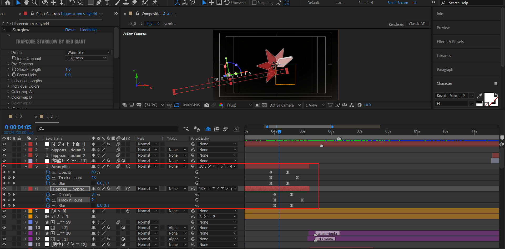

# 2_2

## 合成分析

### 花瓣旋转汇聚

花瓣顺时针旋转汇聚成完整的花朵。

### 弹奏

花朵掉落地面后，反向弹起。

---

花朵散落为花瓣，花瓣掉落地面后，反向弹起，然后花瓣变形为种子seed的形态。

---

种子seed掉落，反向弹起，然后固定在空中。每个种子释放一个黑色的圆圈波纹。

---

背景弹奏。

### 新花瓣掉落

掉落的花瓣弹起后变为种子（六边形），新的花瓣接着继续掉落。这里具有非常明显的音乐节奏。

---

最后，黑白化画面，整体掉落。

## 大花瓣的入场

### 花瓣缩小

### 蜘蛛纹理

创建一个形状层，绘制多个类似蜘蛛的纹理：折线。然后使用中继器，对前面绘制的所有折线复制1次。

关键参数说明：

scale的X轴轻微缩小到96%，Y轴缩小到70%。跟实际相符。

现在，花瓣就具有了纹理。

---

纹理的动画。

首先对end属性K帧从0到100%，实现蜘蛛纹理的Y轴向上生长。

然后对start属性K帧从0到100%，实现纹理从尾部消失，一致蔓延到开头。

### 四周的化学式点缀

时间轴面板中，红线框中都是1帧长度的化学式合成，尺寸较小。随机出现在花瓣的四周。

## 旋转吧，彼岸花

### 一片花瓣的缩小

这里，花瓣旋转了180度。而且，尺寸再次缩小，通过Z轴位置控制。缩小后，保证花瓣旋转中心为画面中心。

### 其余五片花瓣

选取这5片花瓣中，最先出现的一片进行分析：

三个要点：

1. 父链接到之前的大花瓣图层，index 109。
2. tint效果，初始为白色，然后变回正常的红色。
3. 对Z rotation K帧，旋转一定角度，开始时与大花瓣重合，结束时角度刚好紧贴大花瓣，间隔360/6=60度。

---

使用图层副本的方式，制作剩下的花瓣。只需要修改图层层叠顺序，开始时间点，以及微调关键帧。

### 文本

这里创建两个文本：Amaryllis、Hippeastrum × hybrid。将它们绑定到109图层，也就是之前的大花瓣图层。

文本动画为：

- 字符间距从很大到正常。
- opacity淡入。
- Y轴从模糊到清晰。

---

动画结束后，现在的效果是：

## 花朵掉落

背景制作一个圆圈波纹揭示；文本整体上移出场，此时花朵保持位置不变。

随后花朵整体下移掉落。

### 背景圆圈波纹

新建一个圆形的形状层，填充为非黑色（原作为红色）。对size K帧，从0到很大的数值（直到画面外）。

新建一个白色纯色层。应用alpha遮罩。

### 文本上移，花朵保持不变

这里，文本需要上移出场。使用摄像机的空对象来控制，K帧：Y位置属性增大。

此时，花朵需要保持位置不动。也就是需要单独取消摄像机的K帧影像。

我们点开109大花瓣图层，即可知道原因。

摄像机空对象Y K帧：从180到860。变化为+680。此时摄像机为Y下移。受控的3D图层应该会上移680px。

109索引的图层的Y K帧：从187到980。变化为+793。此时花朵表现为Y下移793px。虽然这里抵消的距离并和680不一致，但是基本维持了花朵在画面中心的位置不变，对比画面中心而言稍微下移。

### 水面的出现

一个形状层，绘制椭圆，Y位置K帧上移。

---

花朵碰到水面后，需要制作花瓣散开和水面涟漪扩散。

### 花瓣散开

这里使用了新的花瓣图层作为出发点。不再使用之前旧的花瓣图层。

---

这里6片花瓣的关键帧有点复杂。按照分治的方法论，选取一个图层进行具体分析：

先考虑位置运动。忽略着色变化、曝光、以及花瓣变形为种子这些关键帧。

那么现在先考虑X位置、Y位置和Z rotation的变化，Z position可以忽略不计。

- X位置：左移。线性关键帧。

  

- Y位置：弹跳动画。本质是物理学中物体反向运动与能量的衰减。不能忽略空气阻力等要素，下一次的Y高度峰值比上一次要低一点。

  

- Z 旋转：全程每个阶段都是逆时针旋转，自由发挥。

---

现在，可以思考着色TINT、曝光、以及花瓣变形为种子这些关键帧。

- 在每一次碰到水面时，使用exposure着色白色，其余时间保持灰色。

  

- 第一次碰撞水面~第二次碰撞水面的过场中，对形状层图案的path K帧，变为seed形态。

  

- 末尾时间，使用TINT着色，实现seed灰-黑-灰-黑的颜色变化。

  

---

根据上面的制作原理，制作6个花瓣的动画。编排为左边3个花瓣，右边3个花瓣。

### 水面涟漪

每次花瓣碰到水面是，水面应该激起涟漪。

---

使用自定义视图，调节到类似TOP的视图进行观察。

- 制作两个圆，一大一小，大的为外圆，小的为内圆。
- 外圆扩散比内圆要稍微快一点，但是两个圆结束关键帧的size保持一致。
- 添加合并路径，设置为相减。

### 背景舞台光

在花瓣碰到水面的同时，除了制作上面的水面涟漪进行呼应外，背景也需要制作类似舞台的炫酷灯光。

---

原理是对形状层的path进行K帧，表示弧形的收束。

### 种子的空中固定

序号1-6标记了种子变黑的顺序。

---

- size 放大，一直扩散到画面外。
- stroke width设置描边从大到0。

## 新花瓣的掉落

- 文本短暂居中出现，然后消失。
- 背景短暂改为深红色和白色，通过TINT实现。之后恢复黑白调。
- 新花瓣从上方入场，开始掉落。

---

- 花瓣掉落后，碰撞水面，然后反向弹起，变为种子。新花瓣继续掉落。
- 每个花瓣碰到水面的瞬间，都要制作涟漪散开进行呼应。
- 背景的舞台光改变了形状。现在也是圆形波纹扩散了。

下面对圆形波纹扩散进行说明。

### 圆形波纹扩散

使用形状层，在画面区域绘制很多个圆形，在时间上延迟一定帧数依次排列。制作size放大的关键帧。

添加合并路径，设置为 Exclude Intersection（排除交集）。也即是圆圈交集的区域被删除。仅对剩下的部分进行上色。

## 整体出场

## 小结

- 使用形状层的path关键帧，或者缩放关键帧+合并路径模式，可以制作酷炫的舞台灯光效果。
