# 2_3

## 花散与六边形的制作

### 花散组1

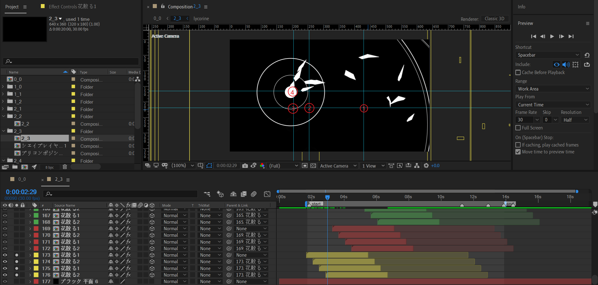

使用之前创建的花散合成（花散1，花散2），创建四个在时间上紧密连接的花散动画。

将这4次花散视为一个花散组。

### 六边形百叶窗组1

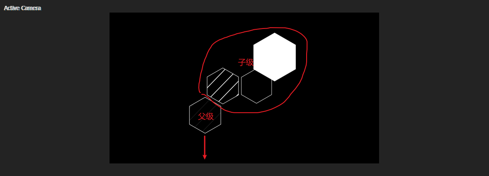

在每次花散组动画的同时，需要制作六边形下移的动画，一共有4个六边形。

选择最先出现的六边形作为父级，其余3个六边形作为子级。只对父级六边形K位置关键帧。

注意到六边形自身具有百叶窗的擦除动画。下面我们来看下这个六边形合成的内部实现。

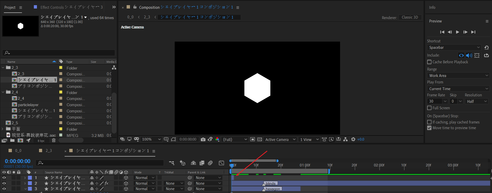

里面一共三个图层。

第一个图层（index 1）为一个白色六边形，没有关键帧，时间很短。

第二个图层（index 2）为百叶窗，先跳过。

第三个图层（index 3）为新的六边形，有两段放大动画：从较小的尺寸放大，以及迅速放大直到画面外。

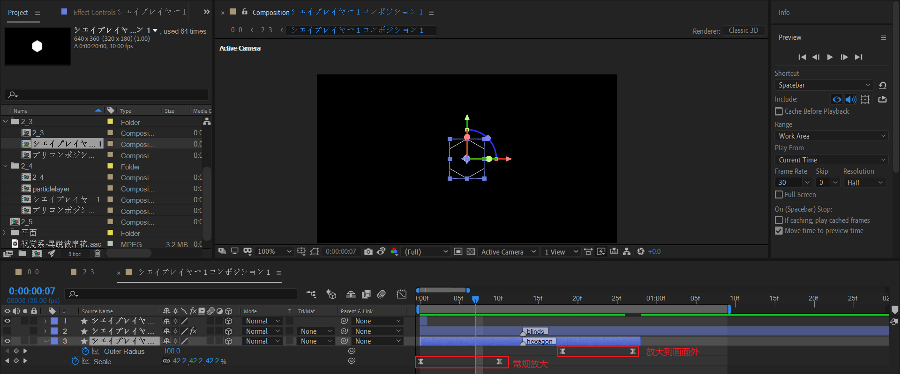

现在，来看中间的百叶窗图层。

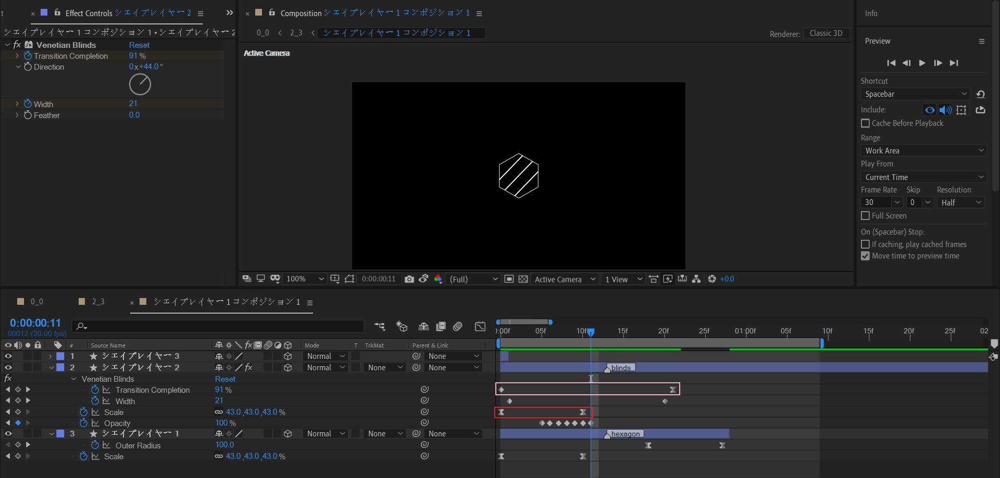

- 创建index 3图层的副本，去掉末尾的放大关键帧，将描边改为填充。为白色填充的六边形。
- 将index 3图层的scale动画关键帧复制到该图层，对齐时间。
- 添加百叶窗效果，设置过渡从0到100的关键帧过渡。
- 中间制作opacity闪烁关键帧。

这个合成的有效长度裁剪到1s左右。

---

结合之前的花散，目前效果为下图。

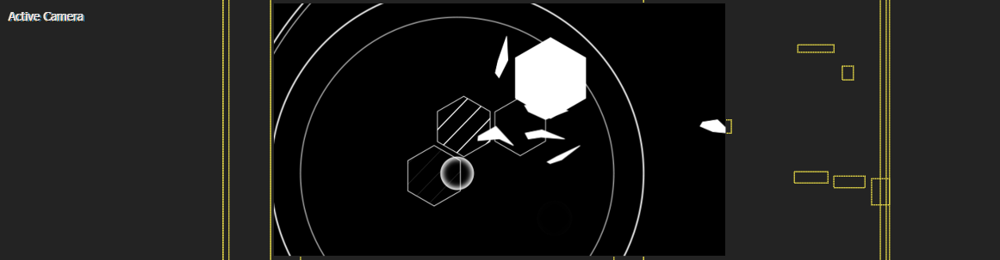

## 顶层调节层：发光

在顶层添加调节层，使用两层glow给画面整体添加发光。

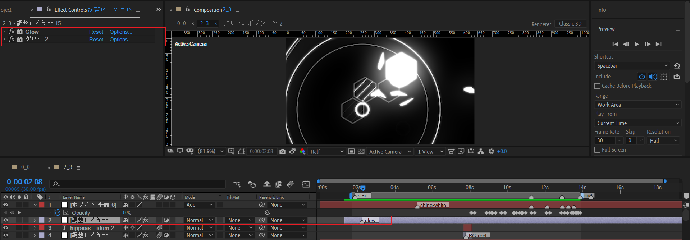

## 持续不断的花散与六边形

图层index 179-139 均为花散合成。

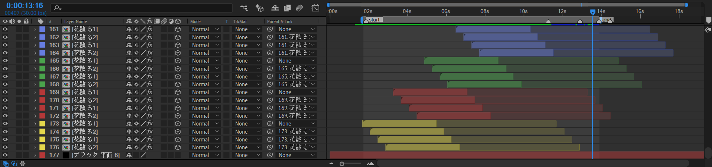

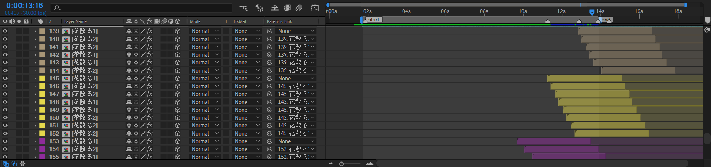

---

图层index 138-75均为六边形合成。

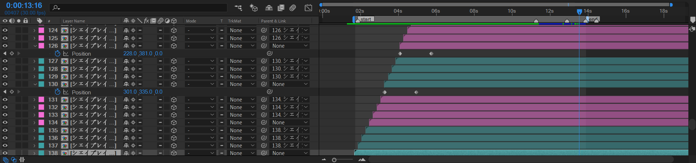

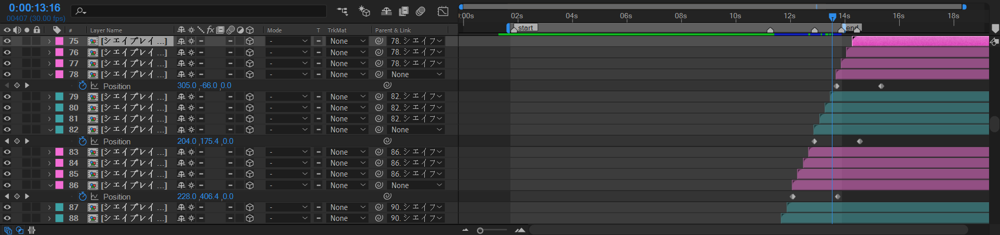

## 中途背景切换

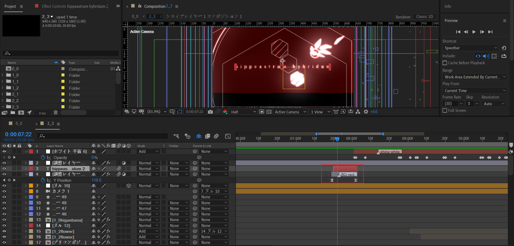

在这段合成的大约中间时间位置，使用调节层创建一个红色的矩形背景入场，从Y轴上方入场，直到覆盖画面。

同时，居中出现一个文本层：hippeastrum hybridum。

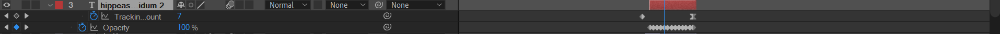

文本层制作字符间距缩小，同时全程opacity闪烁。

## 画面间隔性闪白

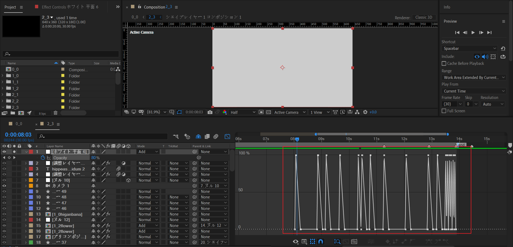

在顶层添加一个纯色白色层，设置图层模式为加亮系，这里是ADD。

然后根据音乐节奏，对opacity进行0和100之间的跳动。这里使用值曲线来K帧。速度曲线参考意义不大。

## 画面斜向的圆环扩散

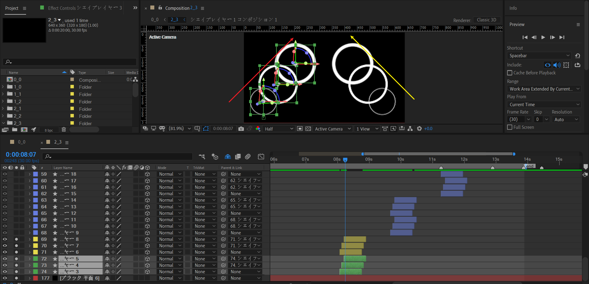

6个圆环为一组。左右各3个圆环。其中，左侧3个圆环中，选一个作为父级，其余两个作为子级。右侧同理。

箭头表示圆环的入场先后顺序。也就是下面的先出场，上面的后出场。

下面，我们来看下圆环自身的动画关键帧。

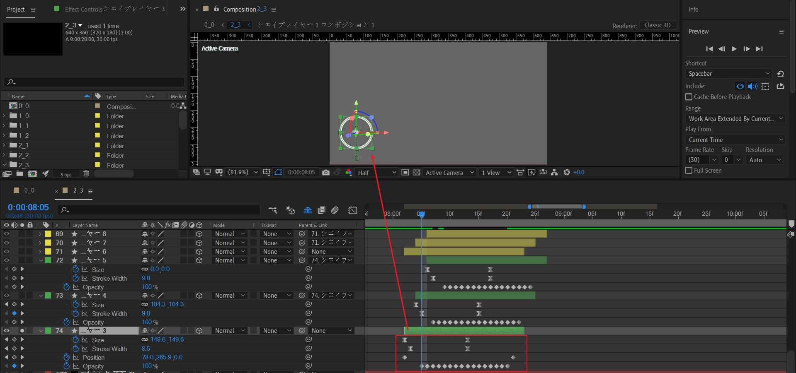

- 首先，父级圆环对size属性K帧实现放大，对stroke width K帧实现描边的缩小。
- 接着，对position的Y轴K帧实现下移。对opacity进行0和100之间的跳跃，实现闪烁。

- 子级圆环，不需要对position K帧。它的位移是跟随父级图层的。

---

圆环图层从index 74到34。

## 化学式与对应文本

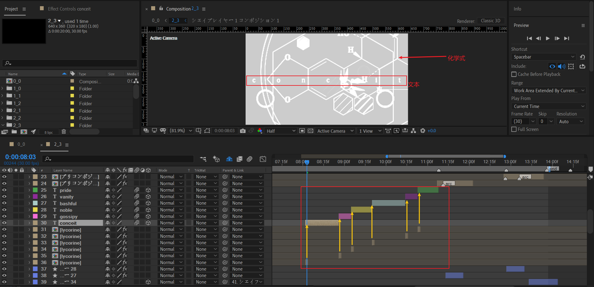

这里，需要6个化学式与6个文本。每个化学式和一个文本在时间轴上一一对应。

文本图层动画如下：

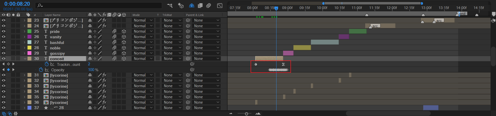

- 字符间距缩小。
- opacity在末尾时间闪烁。

按照一样的原理，制作这里全部的化学式与对应文本。

文本先后分别为：conceit、gossipy、noble、bashful、vanity、pride。

化学式合成都是之前的lycorine。

## 扇形转场，花瓣重新出现

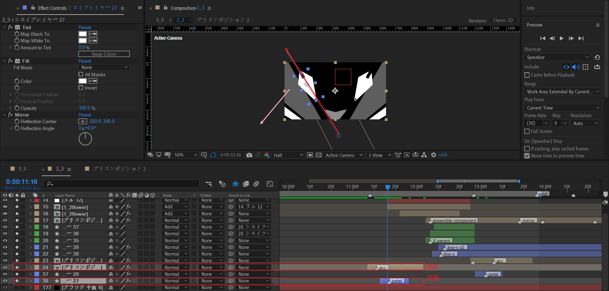

- 花瓣按红色箭头方向位移。
- 背景扇形以画面底部中心为锚点，逆时针旋出画面外。按粉色箭头方向运动。
- 图中左右对称的镜像效果是通过对图层添加mirror效果实现。

## 花朵跟随花瓣入场

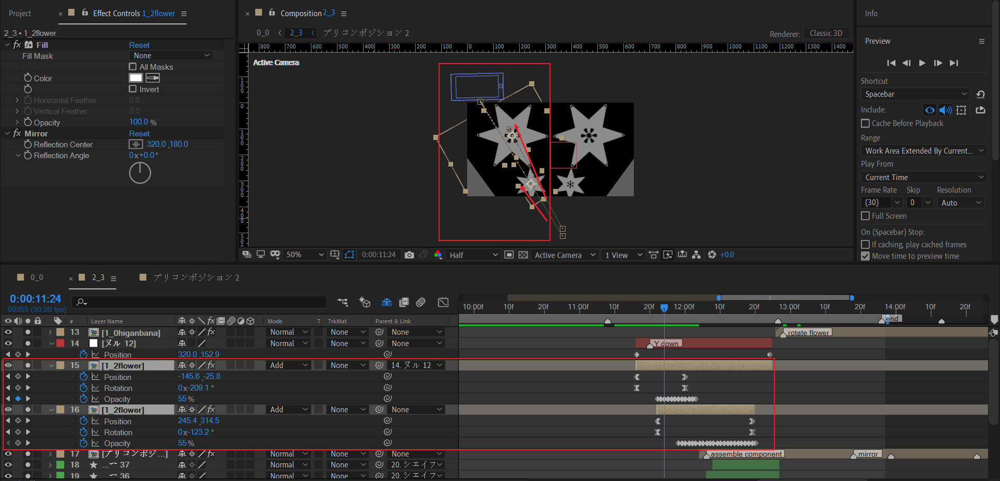

使用之前的flower合成副本，复制成2个，按一定时间延迟排列。

对flower合成本身，制作位移动画和轻微的逆时针旋转，以及合适的闪烁。

最后，创建一个空对象（index 14）管理最先出现的花朵合成（index 15），index 16这个花朵合成不需要额外运动控制。

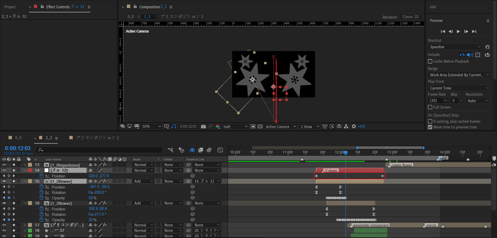

空对象 index 14只需要制作Y下移动画。因此，最后，大花朵下落，小花朵从画面上方飞出。

## 后续动画

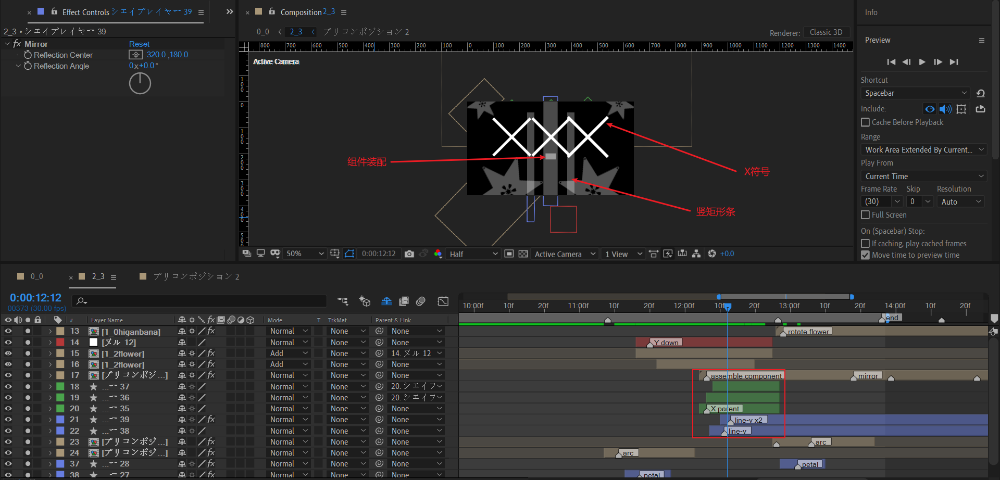

这里由三个部分组成。

### 竖矩形条

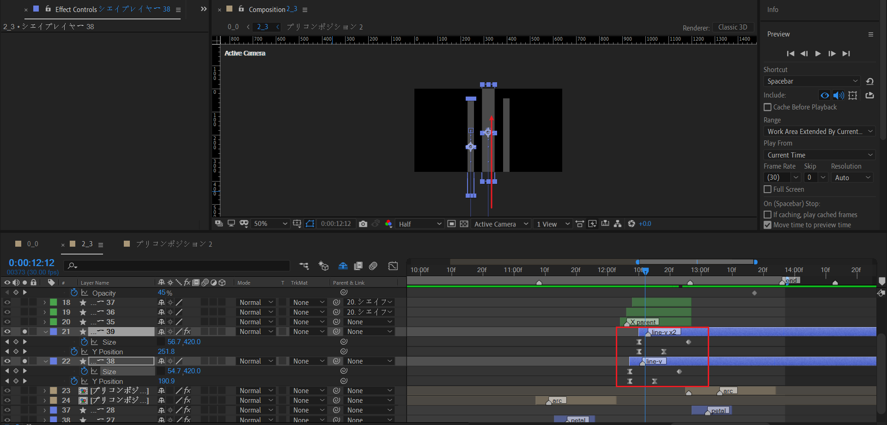

上移过程中，矩形宽度逐渐加速地缩小。

### X符号

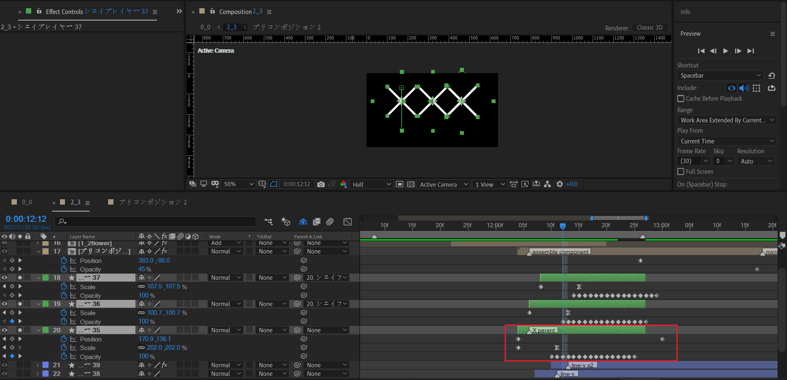

Y下移，scale缩小，opacity闪烁。

### 组件装配

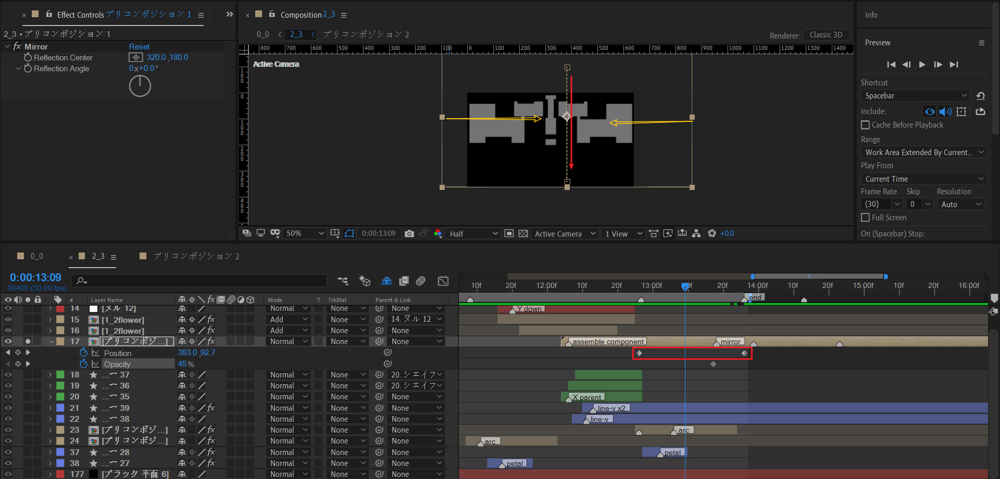

Y下移。

### 花瓣，扇形，花朵旋转

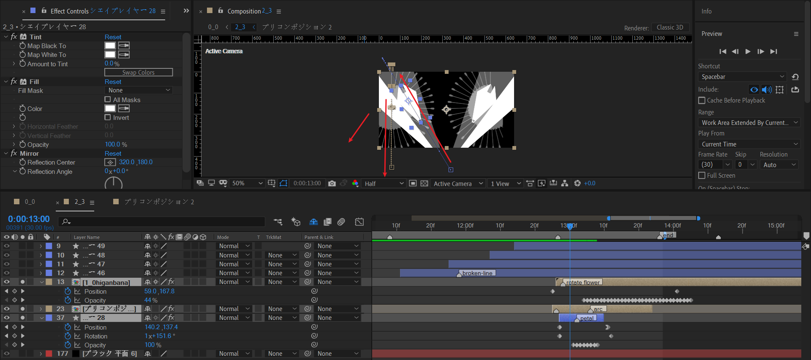

## 最后的补充：折线扫描

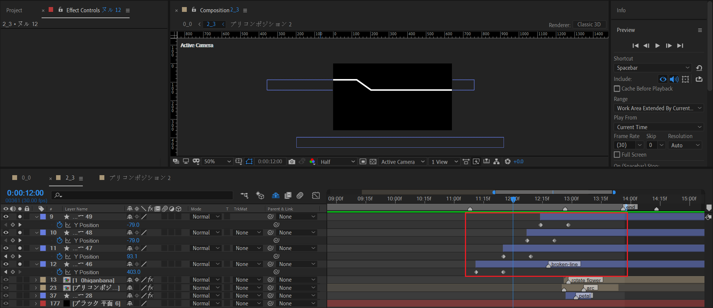

4个折线，依次Y下移运动。

## 小结

- 大量重用之前的合成，是一种能显著提高制作MAD速度的技巧。~~我这就去LOOP一遍，时长加倍。~~

- 面对大量的图层拆解时，可能耐心才是最为宝贵的驱动力。

