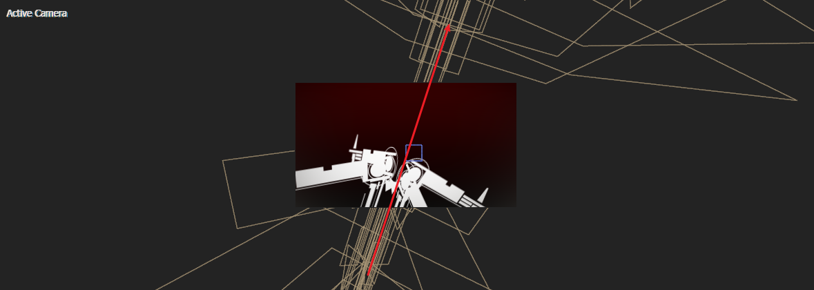
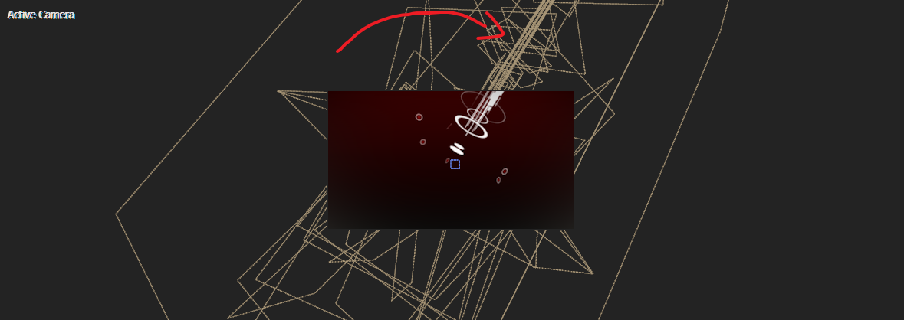

# 2_4

## 文字帅气出场

> 異説 彼岸花|第一|原初の|アマリリス

| 1                                                            | 2                                                            |
| ------------------------------------------------------------ | ------------------------------------------------------------ |
|  |  |

| 3                                                            | 4                                                            |
| ------------------------------------------------------------ | ------------------------------------------------------------ |
|  |  |

这里，制作了四个快速的文本层出场。文本之间出场方向是大致相反的，在极端的时间内，可以后面的轨道炮出场蓄势。

---

然后，在文本层之上，添加一个调节层，添加starglow效果。使得文本和花朵背景发光。

这里，发光依旧采用橙色的中间调。

## 轨道炮合成的制作

> 这是一个非常复杂的模型制作。请保持足够的动力和耐心，累了不妨中场休息。

我们要使用AE创建这样一个复杂的轨道炮。

| 1                                                            | 2                                                            |
| ------------------------------------------------------------ | ------------------------------------------------------------ |
|  |  |

这个轨道炮分为两大部分：

- 上方的花朵，可以绽放，也可以收束。
- 轨道炮主体，由很多形状层拼合组成。

### ~~观察：底座~~

使用自定义视角观察：

| 正面                                                         | 俯视                                                         |
| ------------------------------------------------------------ | ------------------------------------------------------------ |
|  |  |

- 首先是底面的两个圆圈，一大一小，白色描边。
- 然后是中央的旋转轴杆，杆的末端有3个月亮。
- 旋转杆的四周有4个杆子，4个杆子上方分别有4个小矩形。

### 底座：3个圆圈

一个白色填充内圆，两个白色描边外圆。动画都是扩大，其中内圆有闪烁。

### 底座：3个月亮

3个月亮的图层都是合成类型。月亮从下往上擦除的动画在自身合成内完成。

总体的动画。

### 1个中心轴和3个环绕轴

- 中心轴先Y上移，伴随闪烁。
- 然后是3个环绕轴Y上移，伴随闪烁。

从俯视图观察，可以更加清晰地理解它们XZ维度的位置分布。

### 组件：旋转轴承

这个组件由3个部分组成，对应3个图层。

---

第一部分。

该图案由2个部分组成。

- 粉色框为两个矩形条，Y上移。伴随闪烁。
- 红色框为许多矩形拼接裁剪后的图案（通过合并路径），X左移。伴随闪烁。

动画结束后，截图。

---

第二部分。

这部分由三个圆和一个三角箭头组成。

动画分为两个阶段。

第一阶段：红色框关键帧。三个圆扩散。同时，三角箭头保持位置不动，间隔地闪烁。

第二阶段：三角箭头先旋转180度到右侧，然后最小的圆闪烁，同时三角箭头继续旋转，直到回到原地，刚好满一圈。

---

第三部分。我们需要制作这样一个图案。该图案由四部分构成。

上下图形相对运动，水平的两个图形都是X右移。图形的出场闪烁可以适当添加。

---

组件1的第一部分带动第二部分，第二部分带动第三部分，通过父子链接绑定。

组件1运动的末尾截图帧。

| 1                                                            | 2                                                            | 3                                                            |
| ------------------------------------------------------------ | ------------------------------------------------------------ | ------------------------------------------------------------ |
|  |  |  |

圆圈是旋转轴心，第三部分以此旋转。

### 旋转轴承 X4

上面我们已经了解了旋转轴承组件的制作。下面我们需要制作4个这样的轴承。

自定义视图观察：

| 俯视图                                                       | 俯视图（偏移）                                               |
| ------------------------------------------------------------ | ------------------------------------------------------------ |
|  |  |

| 正视图1                                                      | 正视图2                                                      | 正视图3                                                      |
| ------------------------------------------------------------ | ------------------------------------------------------------ | ------------------------------------------------------------ |
|  |  |  |

### 中间回顾1

我们目前建模进度是这样的。下面我们继续添加元素。

### 圆圈与小球汇聚

首先是两个描边的圆圈的尺寸扩大，同时描边逐渐缩小。

---

然后是三个小球从外圆边缘等距出现，对应size的增大。

接着，从俯视图观察。

三个小球逆时针旋转，同时往圆心汇聚，同时Y上移。同时，size缩小到50%左右。

在中间阶段，底层补充给一个圆圈。

之后，三个小球的size开始增大，直到180%左右，汇聚成一个白色大圆。

在汇聚后的白色大圆上移过程中，它的周围也会出现其他元素。下面会说明。

---

汇聚的白色大圆上升过程中，底下有三个白色描边的圆圈依次出现，三个白色填充的小圆依次出现。

它们的出现方向是相对的。如图所示。

之前汇聚的白色填充大圆位于最上面。

我们继续拆解上面的图层。

### 1个中心轴和4个环绕轴

| 中心轴                                                       | 环绕轴                                                       |
| ------------------------------------------------------------ | ------------------------------------------------------------ |
|  |  |

需要注意的是：

- 中心轴和环绕轴都是Y上移。其中环绕轴父链接到中心轴，运动由中心轴控制。
- 中心轴和环绕轴的闪烁刚好错开，也就是对于opacity属性，你是100时，我是0。

### 4个六边形

这里需要制作4个六边形。这四个六边形的动画都是一样的，只是出现时间点序列化。

取最开始的六边形进行分析。

该图案制作思路是：三个六边形取交集，以及给中央的六边形描边。

动画关键帧：

- 入场多次闪烁
- scale从很大值一直缩小到合适的值。

### 3个滑动组件

这三个滑动组件都是同构的，那么问题简化成制作其中一个组件。

这个组件分为两部分

| 1                                                            | 2                                                            |
| ------------------------------------------------------------ | ------------------------------------------------------------ |
|  |  |

### 折线组

滑动组件的顶部，会出现这些折线。

单独显示，是8条折线。

动画的末尾，会形成这样的折线。

根据同构性质，我们只需要考虑其中一根折线。

矩形描边+裁剪路径百分比+裁剪路径关键帧即可完成。

### 中间回顾2

经过艰苦奋战，现在我们来到了这个进度。

| 远景                                                         | 近景                                                         |
| ------------------------------------------------------------ | ------------------------------------------------------------ |
|  |  |

快了快了，进度已经85%了。

### 炮口的花瓣 X6

先理解我们的制作目标。

这里有6片花瓣，动画顺序为先展开3片，然后展示3片。

这6片花瓣结构上都是同构的，因此问题转化为制作其中一片花瓣。

现在，开始细分这个花瓣的组成元素。

4个点，2条线，3个面（面1,2,3），一共9个图层。

下面我们逐个说明这些元素的制作。

---

面1。

入场闪烁。X轴旋转一定角度，模拟花瓣展开。这是一片花瓣中的一部分。

---

线。

X轴扩大，表示线从中心往两侧伸长。

---

点。

点由两个圆圈组成，内圆填充红，外圆描边白。关键帧为入场闪烁和size扩大。

---

面2。

入场闪烁。X轴旋转一定角度，模拟花瓣展开。这是一片花瓣中的一部分。

---

面3。

入场闪烁。X轴旋转一定角度，模拟花瓣展开。这是一片花瓣中的一部分。

---

### 炮口花瓣的动画

先是深红色的3片花瓣出场。

在深红色的花瓣开始展开的5帧之后，开始粉色花瓣的展开。

---

目前的效果示意图。

这个轨道炮合成终于完成了。我们回到合成2_4。

## 轨道炮动画编排分析

我们先看下要达到的目标效果。

| 1：倾斜，视线右上角移动                                      | 2：逆时针旋转                                                |
| ------------------------------------------------------------ | ------------------------------------------------------------ |
|  |  |

| 3：顺时针旋转                                                | 4：顺时针旋转                                                |
| ------------------------------------------------------------ | ------------------------------------------------------------ |
|  |  |

| 5-1: 四炮同屏，上拉（~~显卡落泪~~）                          | 5-2: 轨道炮下沉                                              |
| ------------------------------------------------------------ | ------------------------------------------------------------ |
|  |  |

| 6：倾斜，视线右上角移动                                      | 7：与6关于竖轴对称                                           |
| ------------------------------------------------------------ | ------------------------------------------------------------ |
|  |  |

| 8-1：垂直摆放，视线上移                                      | 8-2：标准俯视图，5炮同屏                                     |
| ------------------------------------------------------------ | ------------------------------------------------------------ |
|  |  |

## 轨道炮动画的摄像机控制

有了上面的列表分析，我们一步步来实现摄像机K帧。

> 注意，原作中摄像机开了景深，个人建议对于这种复杂的光污染场景，可以考虑不打开摄像机景深，因为：
>
> - 效果对比不明显，而且后续对画面添加整体模糊，景深效果会被极大削弱。
>
> - 可以减轻电脑计算压力。
> - 如果的确需要景深，可以选择在制作预览时不打开，最终渲染输出时再打开。

### 1

红色线框看似很多关键帧，最关键的就是右上角位移。结束后，截图如下：

### 2

关键点：以花朵中心为旋转锚点，将轨道炮逆时针旋转。结束时的截图。

### 3

开始时，轨道炮位于右上角。

顺时针旋转，将花瓣重新旋回画面中心区域。如图所示。

### 4

继续以花瓣这端为旋转锚点，顺时针旋转大约180度。此时花瓣依旧位于画面中心区域。

### 5-1 & 5-2

四炮同屏从这里开始。

5-1

---

5-2

这里可以认为是暴力K帧，没有特殊的含义。

### 6

关键点，摄像机右上角位移。其余细节可以自由发挥。

### 7

关键点，摄像机左上角位移。其余细节可以自由发挥。

### 8

五炮同屏从这里开始。

首先是垂直摆放，视线稍微Y上移。

---

然后，关键为将X轴旋转90度。达成俯视图效果。同时，可以对空对象Z rotation添加旋转效果，更加生动。

## 画面调节

三个调节层，分别添加fast blur、starglow、glow（效果不明显）。这里，按需调色即可。

## 补充：背景花瓣粒子

最后，为轨道炮补充花瓣粒子背景，主要使用particular实现。并添加glow制作发光。

粒子纹理层：

在后续冻结发射器，以及设置极大的粒子空间。

## 小结

- 交错位移方向，交错旋转方向，旋转XYZ轴，可以使得物体的重复出场显得不同，避免乏味。
