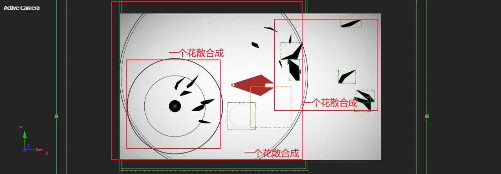
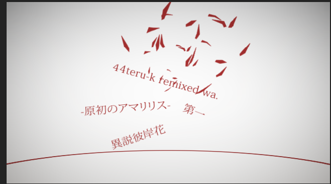

# 2_5

## 花瓣空中逆时针旋转

首先导入一片彼岸花花瓣，对这片花瓣制作X左移以及逆时针旋转。

然后，制作花瓣的Y下移。

理论上说，目前的花瓣是会X左移，飞出画面外的。

为了将视觉焦点锁定到花瓣，利用两个物体的相对运动原理，可以新建一个摄像机来观察花瓣。

> 当摄像机的位移与花瓣的运动近似同步时，看起来花瓣似乎一直在画面中央区域。

了解原理后，新建摄像机并绑定到空对象，将花瓣的位移关键帧复制到空对象。

- 可以对空对象的XY关键帧微调，避免花瓣看起来位置绝对静止。
- 空对象在前期需要拉远。

## 花瓣掉落触发涟漪

制作一个圆圈，对size制作放大，放大结束后保持状态。

## 白底以及画面压暗角

画面主体完成，剩下的就是根据音乐节奏补充其他元素。

## 花散

这里有两种花散：

- 一种是伴随圆圈扩散的花散合成。（图中左侧红线框）
- 一种是只有花瓣飞散的花散合成，没有圆圈扩散。（图中右侧红线框）

合理搭配这两种花散合成，踩住音乐节奏，均匀地填充画面。这里关键要求是踩住音乐节奏。

持续这种方式，直到时间线抵达花瓣掉落。

## Credit

最后的署名环节。

### 文本动画

入场时，利用mask path变形来逐步显示出最终的文本。mask的形状足够随机即可。

---

此外，制作Y上移和Z 旋转。

### 花散动画

使用四个花散作为一组，制作倾斜的向上花散。

---

按照上面的做法。制作剩下的3个文本，以及对应的3组花散。列表如下：

| 1                                                            | 2                                                            |
| ------------------------------------------------------------ | ------------------------------------------------------------ |
|  |  |

| 3                                                            | 4                                                            |
| ------------------------------------------------------------ | ------------------------------------------------------------ |
|  |  |

## 小结

- 利用物体和摄像机的同步位移，来保持物体在视觉上的相对静止状态。
- 利用大量重复的圆圈扩散、花瓣扩散来对应音乐节奏的踩点。

